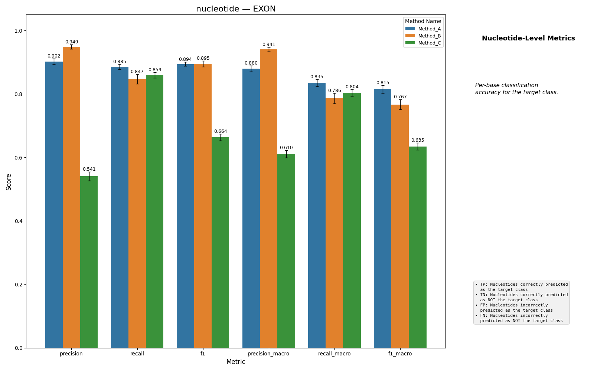
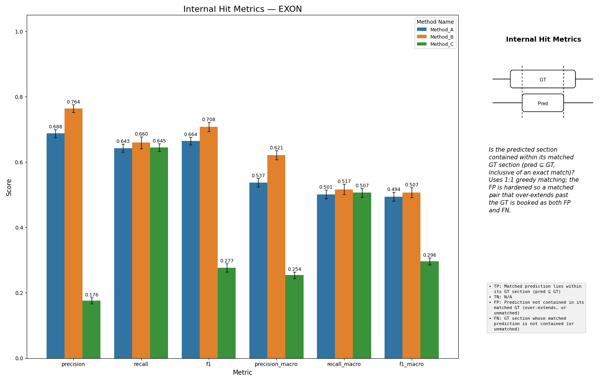
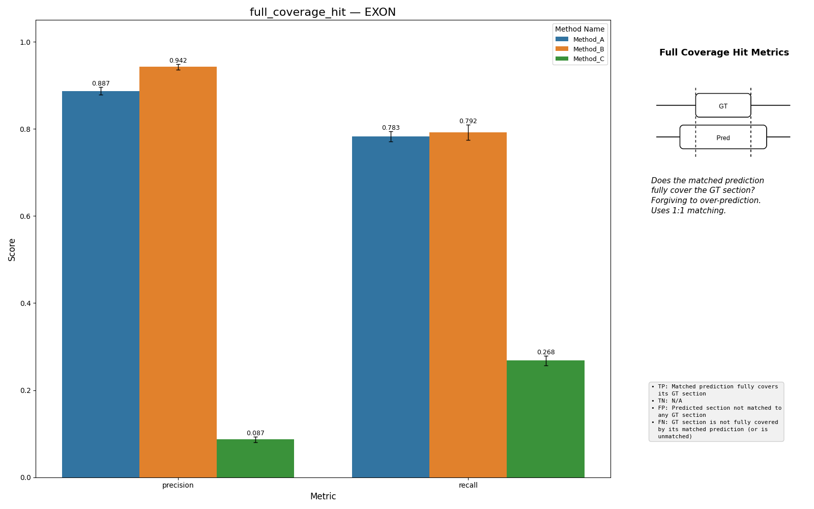
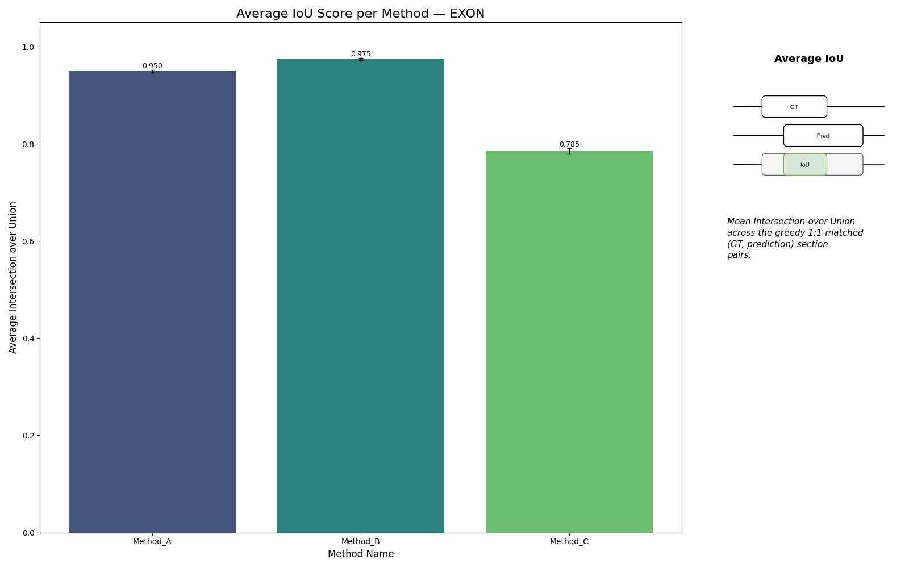
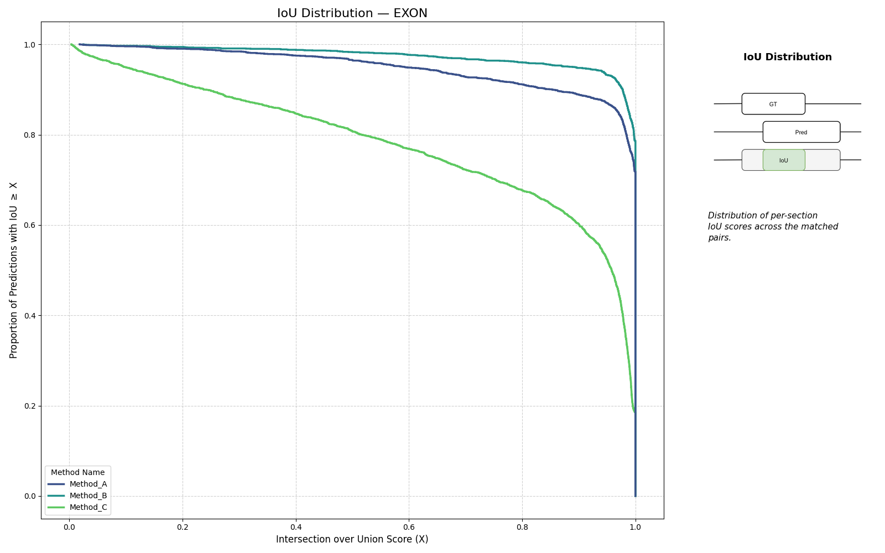

# DNA Segmentation Benchmark

[](https://dna-labeling-benchmark.readthedocs.io/en/latest/)

Diagnostic evaluation toolkit for nucleotide-level DNA segmentation models (gene finders like Augustus, Helixer, Tiberius, SegmentNT) against reference annotations (e.g., GENCODE).

Goes beyond standard precision/recall with an **8-type INDEL error taxonomy**, **boundary bias/reliability landscapes**, **strict intron chain plus per-transcript exon recovery distributions**, **transcript match classification**, and **state transition analysis** -- metrics not available in gffcompare, Mikado, or EGASP.

For continuity with existing tooling, the GFF pipeline also reports a **gffcompare-compatible baseline layer** (nucleotide / exon / transcript / gene sensitivity & precision) under each predictor's `global` results; the diagnostics above are the value this toolkit adds on top of that baseline.

```
pip install dna-segmentation-benchmark
```

## Quick Start

### From GFF/GTF files

```python
from dna_segmentation_benchmark import (
    AnnotationMode, LabelConfig, EvalMetrics, benchmark_from_gff, compare_multiple_predictions,
)

label_config = LabelConfig(
    annotation_mode=AnnotationMode.EXON_INTRON,
    background_label=8,
    exon_label=0,
    intron_label=2,
)

results = benchmark_from_gff(
    gt_path="ground_truth.gtf",
    pred_paths={"augustus": "predictions.gff"},
    label_config=label_config,
    metrics=[EvalMetrics.REGION_DISCOVERY, EvalMetrics.BOUNDARY_EXACTNESS, EvalMetrics.NUCLEOTIDE_CLASSIFICATION],
    exclude_features=["gene"],
)

figures = compare_multiple_predictions(
    per_method_benchmark_res=results,
    label_config=label_config,
    metrics_to_eval=[EvalMetrics.REGION_DISCOVERY, EvalMetrics.BOUNDARY_EXACTNESS, EvalMetrics.NUCLEOTIDE_CLASSIFICATION],
)
```

### From label arrays

```python
import numpy as np
from dna_segmentation_benchmark import (
    AnnotationMode, LabelConfig, EvalMetrics, benchmark_gt_vs_pred_multiple, compare_multiple_predictions,
)

label_config = LabelConfig(
    annotation_mode=AnnotationMode.EXON_INTRON,
    background_label=8,
    exon_label=0,
    intron_label=2,
)

results = benchmark_gt_vs_pred_multiple(
    gt_labels=gt_arrays,       # list[np.ndarray]
    pred_labels=pred_arrays,   # list[np.ndarray]
    label_config=label_config,
    metrics=[
        EvalMetrics.INDEL,
        EvalMetrics.REGION_DISCOVERY,
        EvalMetrics.BOUNDARY_EXACTNESS,
        EvalMetrics.NUCLEOTIDE_CLASSIFICATION,
        EvalMetrics.STRUCTURAL_COHERENCE,
        EvalMetrics.DIAGNOSTIC_DEPTH,
        # EvalMetrics.PHASE_DRIFT,  # only in UTR_CDS_INTRON mode with evaluation_scope='cds'
    ],
)
```

### CLI

```bash
dna-benchmark run \
    --gt ground_truth.gtf \
    --pred augustus:predictions.gff \
    --config label_config.yaml \
    --exclude-features gene \
    --output results.json
```

Generate a starter `label_config.yaml` with `dna-benchmark init-config`
(`--mode exon_intron` or `--mode utr_cds_intron`).

---

## Metrics

Seven scored metric groups, each answering a distinct question about prediction
quality (plus opt-in `STATE_TRANSITIONS`, described below):

| Group | Question |
|-------|----------|
| `NUCLEOTIDE_CLASSIFICATION` | Per-base, how accurate is it? |
| `REGION_DISCOVERY` | Did we find the right regions? |
| `BOUNDARY_EXACTNESS` | How precise are the boundaries? |
| `INDEL` | What structural errors exist? |
| `PHASE_DRIFT` | Is the coding-base phase preserved? |
| `STRUCTURAL_COHERENCE` | Is the overall segment arrangement correct? |
| `DIAGNOSTIC_DEPTH` | Why is the prediction structurally wrong? |

---

### Nucleotide Classification

Per-base TP/TN/FP/FN with precision, recall, and F1. The most basic metric -- treats each position independently.



---

### Region Discovery

Evaluates section-level detection using greedy 1:1 matching by overlap length.
Four **coherent precision/recall tiers** nested by strictness:

| Tier | Type | Meaning |
|------|------|---------|
| `neighborhood_hit` | precision / recall | Detected the region at all (any overlap) |
| `internal_hit` | precision / recall | Matched pair where prediction lies inside GT (pred ⊆ GT) |
| `full_coverage_hit` | precision / recall | Matched pair where prediction spans GT (pred ⊇ GT) |
| `perfect_boundary_hit` | precision / recall | Exact boundary match (sweep-based, no 1:1 constraint) |

The tiers nest: `neighborhood_hit` ⊇ {`internal_hit`, `full_coverage_hit`} ⊇
`perfect_boundary_hit`. Each is a coherent confusion table — every tier hardens
its FP so `TP + FP = total predictions` and `TP + FN = total GT` — so all four are
reported as plain precision/recall. The `internal_hit` vs `full_coverage_hit` split
gives the direction of the boundary error (under- vs over-extension).







---

### Boundary Exactness

How precise are predicted boundaries? Includes IoU distributions and two diagnostic matrices:

- **Bias matrix** (21x21): Signed boundary residuals revealing systematic directional errors (e.g., "predictions consistently start 2bp early")
- **Reliability matrix** (11x11): Cumulative recall at tolerances 0--10 bp, showing how quickly recall degrades as boundary tolerance tightens





---

### INDEL Error Taxonomy

Classifies every contiguous mismatch region into one of 8 structural error types:

| Insertions (pred has class, GT does not) | Deletions (GT has class, pred does not) |
|---|---|
| 5' extension | 5' deletion |
| 3' extension | 3' deletion |
| Joined (merges two GT sections) | Split (splits one GT section) |
| Whole insertion (new section) | Whole deletion (missing section) |


---

### Structural Coherence

Evaluates the predicted segment chain **as a whole** -- not per-section, but as a complete ordered arrangement.

#### Intron Chain Comparison (strict, gffcompare-style)

`intron_chain` emits per-sequence `tp/fp/fn ∈ {0, 1}`: a sequence counts as TP **only if** the entire set of GT introns equals the set of predicted introns. Aggregated across sequences this becomes the familiar corpus precision/recall — directly comparable to gffcompare's intron-chain P/R.


#### Per-transcript Exon Recovery

The binary `intron_chain` metric hides "nearly right" predictions — a transcript with 9 of 10 exons correct scores the same as one with 0 correct. Three complementary per-transcript scalars surface this gradation and are kept as **raw per-sequence lists** so plotting can draw the distribution across transcripts:

- `exon_recall_per_transcript` — fraction in `[0, 1]` of GT exons whose `(start, end)` was recovered exactly. A transcript with 9/10 exons right scores `0.9`. Transcripts with zero GT exons are excluded.
- `exon_precision_per_transcript` — fraction in `[0, 1]` of predicted exons whose `(start, end)` is an exact GT match (`0.0` when the prediction has no exons in scope). The symmetric precision partner to recall.
- `false_exon_count_per_transcript` — integer ≥ 0: predicted exons whose `(start, end)` is absent from GT. The absolute spurious-exon burden a ratio hides.


Rendered as three overlayed histograms; a fat left tail of recall combined with a fat right tail of false exons flags a model that guesses rather than recovering true structure.

#### Transcript Match Classification

Holistic structural classification of each (GT, prediction) pair into one of nine categories
(see :class:`~dna_segmentation_benchmark.eval.transcript_classification.TranscriptMatchClass`):

| Class | Condition |
|-------|-----------|
| `exact` | Identical segment sets |
| `boundary_shift_internal` | Same segment count, outer locus boundaries match, internal splice sites differ |
| `boundary_shift_terminal` | Same segment count, but terminal (locus-edge) boundaries also differ |
| `missing_segments` | Prediction's segment set is a strict subset of GT's |
| `extra_segments` | GT's segment set is a strict subset of prediction's |
| `partial_overlap` | At least one shared segment, but neither equality nor subset relation |
| `substitution` | No shared `(start, end)` segment, but ≥1 predicted segment overlaps a GT segment in base coordinates (relocated/substituted exons) |
| `no_overlap` | No shared `(start, end)` segment and no base overlap |
| `missed` | Prediction has no segments of this class |


#### Segment Count Delta

Over-segmentation (positive) vs under-segmentation (negative).


#### Boundary Shift Distribution

For transcripts where GT and prediction have matching segment counts, the per-transcript
total absolute boundary offset (bp).


---

### Diagnostic Depth

Causal diagnosis of structural errors — answering *where* prediction errors concentrate, not
just *that* they exist.

#### Position Bias

Match rate stratified by relative position inside the GT coding span (5' / interior / 3'),
revealing whether errors concentrate at sequence ends. Two histograms are emitted: false
negatives (GT coding bases the predictor missed) and false positives (predicted coding bases
inside the GT span that are not in GT).


#### Segment-length EMD

Earth Mover's Distance between the GT and predicted coding-segment length distributions.

---

### Phase Drift

Per-position coding-base phase drift, defined as
`|cumulative_pred_coding_count − cumulative_gt_coding_count| mod 3` along the transcript.
Reflects relative coding-base displacement between GT and prediction; it is **not** the
biological reading frame (which depends on the GFF `phase` column and is not consumed here).
Useful as a qualitative diagnostic. When the GT coding length is not divisible by 3 (e.g.
UTRs are painted into the coding mask), the metric is skipped for that sequence with a warning
rather than aborting the run.

---

### State Transitions

Requested via `EvalMetrics.STATE_TRANSITIONS` (included in the default metric set,
so it runs unless you pass an explicit `metrics` list that omits it). Two analyses:

- **GT Transition Confusion Matrices**: At every position where GT changes label, what did the predictor do? One heatmap per source label.
- **False Transition Analysis**: At positions where GT is stable (no label change), did the predictor introduce a spurious transition? Each false transition is classified into *late-catchup*, *premature*, or *spurious* using lookbehind/lookahead context.


---

## Label Configuration

All metrics are label-agnostic. Every `LabelConfig` declares an explicit
**annotation mode** that fixes what the positive labels mean:

| Mode | Positive labels | Use it for |
|------|-----------------|------------|
| `EXON_INTRON` | one `exon_label` | exon/intron structure; tools that don't split UTR from CDS |
| `UTR_CDS_INTRON` | `five_prime_utr_label`, `cds_label`, `three_prime_utr_label` | full transcript anatomy; CDS-scoped metrics; `PHASE_DRIFT` |

```python
from dna_segmentation_benchmark import AnnotationMode, LabelConfig

# Exon/intron structure
exon_config = LabelConfig(
    annotation_mode=AnnotationMode.EXON_INTRON,
    background_label=8,
    exon_label=0,            # required in this mode
    intron_label=2,          # optional; required for intron-chain metrics
    splice_donor_label=1,    # optional; both splice labels set together
    splice_acceptor_label=3, # optional
)

# Transcript anatomy with explicit UTR/CDS
anatomy_config = LabelConfig(
    annotation_mode=AnnotationMode.UTR_CDS_INTRON,
    background_label=8,
    cds_label=0,             # required in this mode
    five_prime_utr_label=4,  # required
    three_prime_utr_label=5, # required
    intron_label=2,
    splice_donor_label=1,
    splice_acceptor_label=3,
)
```

The integer tokens are an internal array-encoding detail. If you are working
from GFF/GTF files and don't care about the specific integers, use the canonical
defaults instead of assigning them by hand:

```python
exon_config   = LabelConfig.default_exon_intron()      # same scheme as BEND_LABEL_CONFIG
anatomy_config = LabelConfig.default_utr_cds_intron()  # explicit UTR/CDS/intron/splice tokens
```

The mode also fixes the **evaluation scope**. Per-transcript metrics run on the
configured `evaluation_scope` (`transcript_exon` by default; `cds` is available
in `UTR_CDS_INTRON`), while global file-level metrics report every available
scope. `PHASE_DRIFT` is only valid in `UTR_CDS_INTRON` with
`evaluation_scope=BenchmarkScope.CDS`.

A pre-built `EXON_INTRON` config for the BEND benchmark is available as
`BEND_LABEL_CONFIG`. See the
[annotation modes guide](https://dna-labeling-benchmark.readthedocs.io/en/latest/getting_started/annotation_modes.html)
for the full walkthrough.

---

## W&B Integration

Log metrics during training and full diagnostic reports after:

```python
from dna_segmentation_benchmark import (
    init_wandb_with_presets,
    log_benchmark_scalars,
    log_benchmark_media,
    log_benchmark_media_videos,
)

run = init_wandb_with_presets("my-project", "run-name", label_config, classes=[0])

# During training -- lightweight scalar logging per epoch
log_benchmark_scalars(val_results, label_config, step=epoch, method_prefix="val")

# Per-epoch diagnostic figures (boundary landscape, position bias, transitions, etc.)
log_benchmark_media(val_results, label_config, step=epoch, method_prefix="val")

# After training -- flush the buffered figure history as W&B videos
log_benchmark_media_videos()
```

Install with: `pip install dna-segmentation-benchmark[wandb]`

---

## Documentation

Full documentation is available at **https://dna-labeling-benchmark.readthedocs.io/en/latest/**

- **[Metrics overview](https://dna-labeling-benchmark.readthedocs.io/en/latest/metrics/overview.html)** — index of every metric group with formulas and aggregation details
- **[Getting started](https://dna-labeling-benchmark.readthedocs.io/en/latest/getting_started/index.html)** — array, GFF, method-comparison, and W&B walkthroughs
- **[API reference](https://dna-labeling-benchmark.readthedocs.io/en/latest/api/index.html)** — Sphinx-generated module documentation
