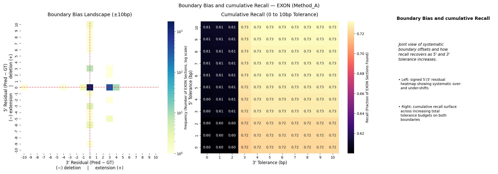
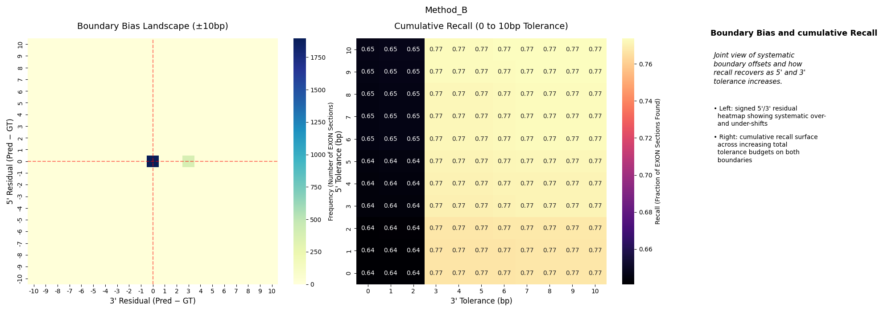
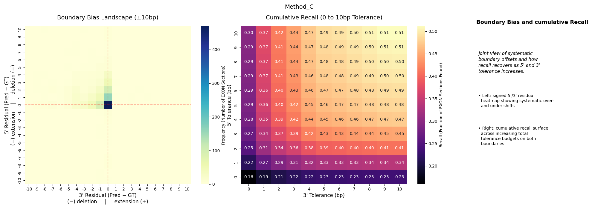

# Method Comparison

Use {py:func}`dna_segmentation_benchmark.compare_multiple_predictions` when you
already have aggregated benchmark results for several methods and want a common
plot bundle.

## Workflow

```python
from pathlib import Path

from dna_segmentation_benchmark import (
    BEND_LABEL_CONFIG,
    EvalMetrics,
    benchmark_gt_vs_pred_multiple,
    compare_multiple_predictions,
)

metrics = [
    EvalMetrics.INDEL,
    EvalMetrics.REGION_DISCOVERY,
    EvalMetrics.BOUNDARY_EXACTNESS,
    EvalMetrics.NUCLEOTIDE_CLASSIFICATION,
    EvalMetrics.STRUCTURAL_COHERENCE,
]

all_results = {
    "segmentnt": benchmark_gt_vs_pred_multiple(
        gt_labels=gt_arrays,
        pred_labels=segmentnt_arrays,
        label_config=BEND_LABEL_CONFIG,
        metrics=metrics,
        infer_introns=True,
    ),
    "augustus": benchmark_gt_vs_pred_multiple(
        gt_labels=gt_arrays,
        pred_labels=augustus_arrays,
        label_config=BEND_LABEL_CONFIG,
        metrics=metrics,
        infer_introns=True,
    ),
}

figures = compare_multiple_predictions(
    per_method_benchmark_res=all_results,
    label_config=BEND_LABEL_CONFIG,
    metrics_to_eval=metrics,
    output_dir=Path("plots/comparison"),
)
```


## Result Inputs

`compare_multiple_predictions(...)` accepts either:

- raw outputs from {py:func}`dna_segmentation_benchmark.benchmark_gt_vs_pred_multiple`
- pipeline outputs from {py:func}`dna_segmentation_benchmark.benchmark_from_gff`
  where each method result is wrapped as `{"aggregated": ..., "global": ...}`

For the second case, the plotting code automatically unwraps the
`aggregated` section.

## Example Output

The comparison bundle includes per-method plots for boundary landscape, per-class position bias, and transition matrices.

**Boundary landscape:**





**Transition matrices:**


## Interpretation

This plotting layer is comparative, not evaluative on its own. Use the
{doc}`../metrics/index` pages to interpret what each figure means.
