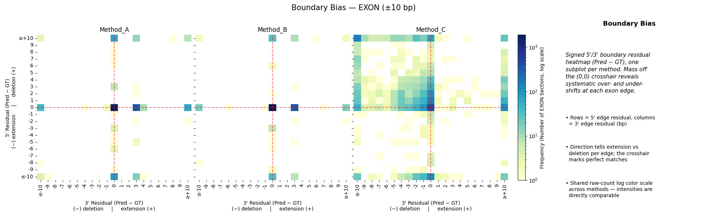
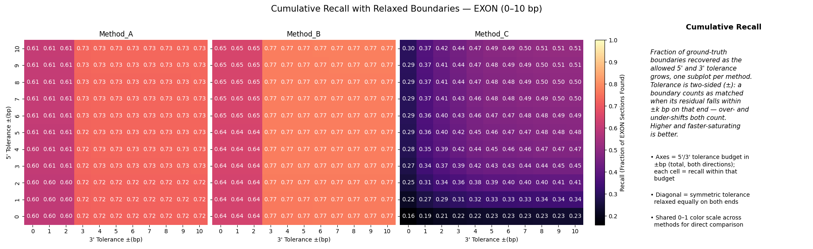
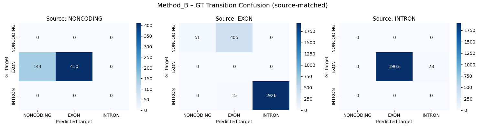
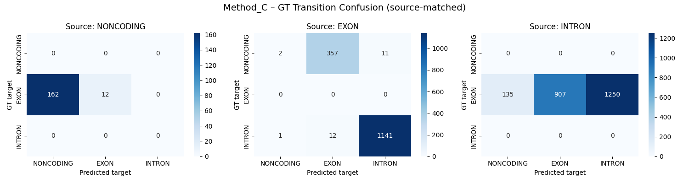

# Method Comparison

Use {py:func}`gene_calling_benchmark.compare_multiple_predictions` when you
already have aggregated benchmark results for several methods and want a common
plot bundle.

## Workflow

```python
from pathlib import Path

from gene_calling_benchmark import (
    BEND_LABEL_CONFIG,
    EvalMetrics,
    benchmark_from_arrays,
    compare_multiple_predictions,
)

metrics = [
    EvalMetrics.INDEL,
    EvalMetrics.REGION_DISCOVERY,
    EvalMetrics.BOUNDARY_EXACTNESS,
    EvalMetrics.NUCLEOTIDE_CLASSIFICATION,
    EvalMetrics.STRUCTURAL_COHERENCE,
]

all_results = {
    "segmentnt": benchmark_from_arrays(
        gt_labels=gt_arrays,
        pred_labels=segmentnt_arrays,
        label_config=BEND_LABEL_CONFIG,
        metrics=metrics,
        infer_introns=True,
    ),
    "augustus": benchmark_from_arrays(
        gt_labels=gt_arrays,
        pred_labels=augustus_arrays,
        label_config=BEND_LABEL_CONFIG,
        metrics=metrics,
        infer_introns=True,
    ),
}

figures = compare_multiple_predictions(
    per_method_benchmark_res=all_results,
    label_config=BEND_LABEL_CONFIG,
    metrics_to_eval=metrics,
    output_dir=Path("plots/comparison"),
)
```


## Result Inputs

`compare_multiple_predictions(...)` accepts either:

- raw outputs from {py:func}`gene_calling_benchmark.benchmark_from_arrays`
- pipeline outputs from {py:func}`gene_calling_benchmark.benchmark_from_gff`
  where each method result is wrapped as `{"aggregated": ..., "global": ...}`

For the second case, the plotting code automatically unwraps the
`aggregated` section.

## Example Output

The comparison bundle includes boundary landscape plots (one subplot per method,
grouped by metric for side-by-side comparison), plus per-method position bias and
transition matrices.

**Boundary bias and cumulative recall:**




**Transition matrices:**





## Interpretation

This plotting layer is comparative, not evaluative on its own. Use the
{doc}`../metrics/index` pages to interpret what each figure means.
