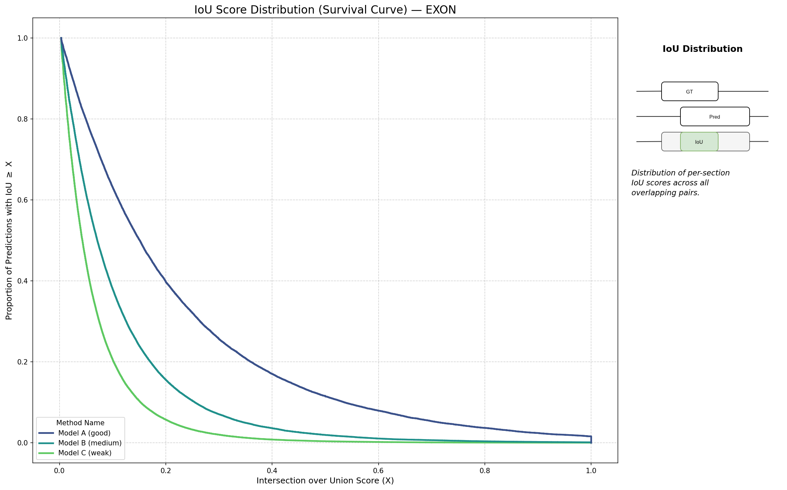
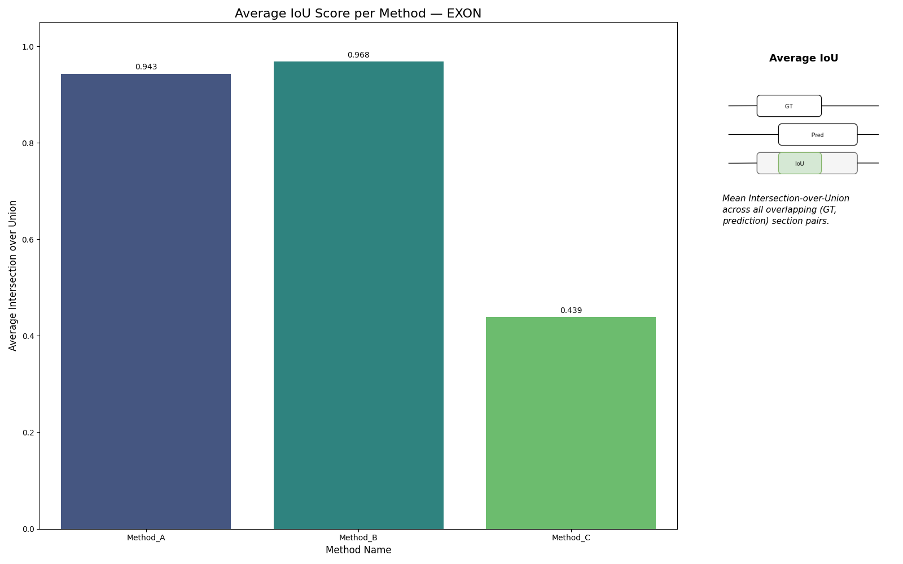
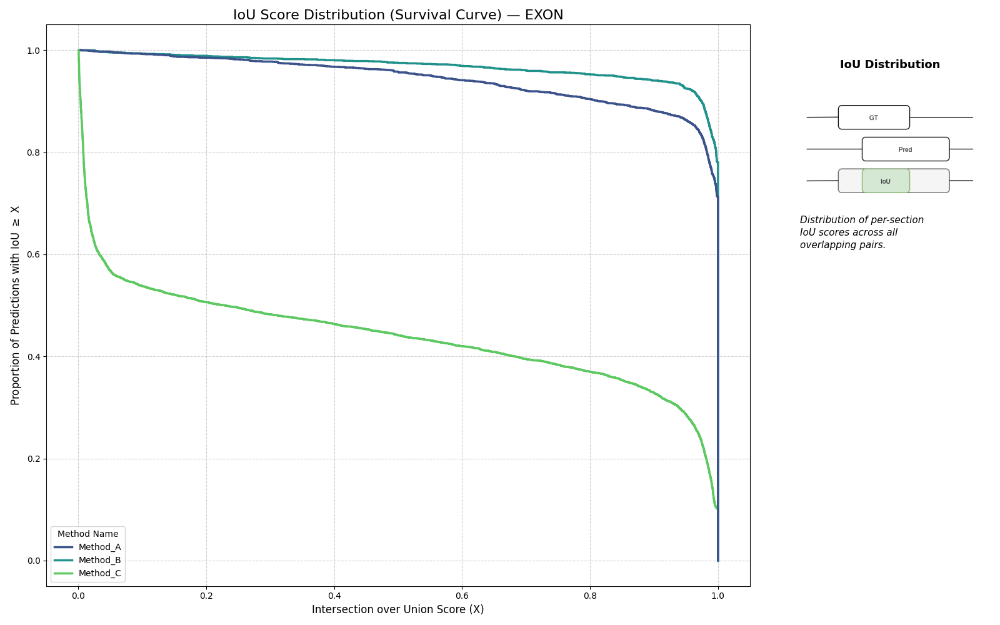
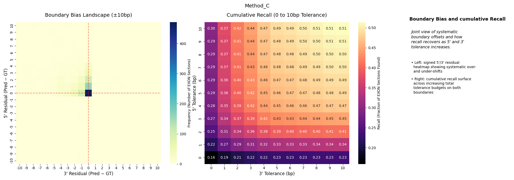

# Boundary Exactness

Boundary Exactness measures how far predicted coding sections deviate from GT
boundaries once there is some overlap.

## What Is Computed

For every overlapping `(GT, pred)` coding section pair, the benchmark records:

- signed 5' residual: `pred_start - gt_start`
- signed 3' residual: `pred_end - gt_end`
- IoU score for the overlapping pair

It also records two terminal-boundary flags:

- `first_sec_correct_3_prime_boundary`
- `last_sec_correct_5_prime_boundary`

These are stored per sequence in
`BOUNDARY_EXACTNESS` and then summarized across many sequences.

## IoU

The raw `iou_scores` list contains one IoU value per overlapping `(GT, pred)`
pair. After aggregation, `iou_stats["mean"]` is the scalar used by the W&B
online logger.

## Boundary Residual Landscape

The raw `fuzzy_metrics["boundary_residuals"]` list contains all signed
residual pairs from overlapping sections. Aggregation turns that into the
boundary bias landscape which can show if certain numbers or nucleotides are consistently over or under predicted.
The cumulative reliability highlights how recall improves if each boundary is counted as an exact match given x 
nucleotides of error in both 5' and 3' direction.

Interpretation:

- values centered near `(0, 0)`: boundaries are usually exact
- mass shifted to negative 5' residuals: predictions start too early
- mass shifted to positive 3' residuals: predictions end too late

## Terminal Boundary Flags

The first GT section contributes a special 3' correctness flag, and the last GT
section contributes a special 5' correctness flag. These are useful for models
that tend to lose one transcript end more than the other.

## Caveats

- Only overlapping section pairs contribute. Completely missed GT sections do
  not add IoU or residuals directly; they matter through Region Discovery.
- Multiple predicted sections can contribute multiple residual pairs against
  the same GT section.
- IoU mean is informative, but it hides whether errors are a few large misses
  or many small offsets. Use it together with the distribution plot.
