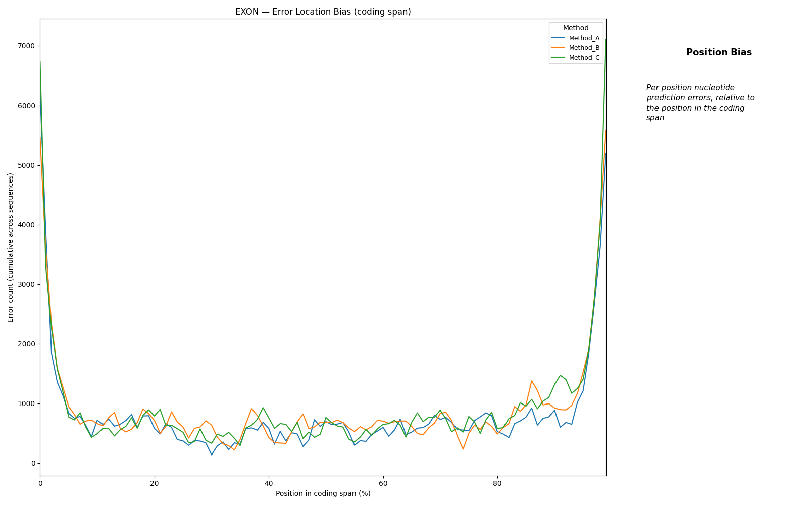

# Diagnostic Depth

Diagnostic Depth complements the per-section and structural metrics with two
distribution-level diagnostics that expose *where* and *how severely* a
predictor fails, rather than just whether it does.

Both metrics are computed for a single label class (typically `EXON`/CDS) and
aggregated across the corpus.

---

## Length EMD

`length_emd` measures how different the predicted segment length distribution
is from the GT distribution using the 1-D Wasserstein distance (Earth Mover's
Distance).

The Wasserstein distance is the minimum "work" needed to transform one
distribution into the other, where work is mass × distance moved. In this
context:

- Low EMD — the predictor produces segments with lengths that closely match
  GT, even if individual segment boundaries are wrong.
- High EMD — the predictor systematically produces segments that are too short
  or too long relative to the GT distribution.

EMD is insensitive to segment identity: it does not penalise a predictor for
getting individual segments wrong as long as the overall length distribution is
correct. This makes it a useful complement to chain-based metrics — a good EMD
with a poor chain score indicates that boundaries are placed but at the wrong
locations; a poor EMD with a good chain score would indicate something unusual
about boundary placement without length distortion.

**Implementation note:** `scipy.stats.wasserstein_distance` is used when
available; otherwise a quantile-interpolation fallback is applied. Both return
0.0 if either the GT or predicted segment list is empty.

---

## Error Location Bias (Position Bias Histogram)

`position_bias_histogram` answers: *where in a transcript do nucleotide-level
errors concentrate?*

A 100-bin histogram is built over the normalised coding span (bin 0 = start of
the first GT coding segment, bin 99 = end of the last). Every nucleotide
position that differs between GT and prediction contributes exactly one count
to its bin:

- A GT nucleotide **not covered** by the prediction (false negative) increments
  the bin at its relative position in the coding span.
- A predicted nucleotide **within the coding span but not present in GT** (false
  positive) increments the bin at its relative position.

Predicted nucleotides outside the GT coding span are ignored, keeping the
histogram bounded to the gene locus.

Unlike the previous segment-matching approach, this counts every boundary
error and every missing or spurious base — including systematic shifts and
extensions that would be invisible when segments are matched by overlap.

### Reading the plot

The x-axis is position in the coding span as a percentage (0 % = transcript
start, 100 % = transcript end). The y-axis is the cumulative count of mismatch
nucleotides across all evaluated sequences.

Common patterns and their interpretations:

| Shape | Interpretation |
|---|---|
| Flat / near-zero | Predictions closely match GT at the nucleotide level across the whole span. |
| Elevated at 0 % and/or 100 % | Terminal boundary errors — the predictor struggles with gene-locus start or end. Common in models that lack UTR context. |
| Elevated in the middle | Internal exon errors — splice-site accuracy degrades for exons far from the transcript termini. |
| Uniform low-level signal | Systematic boundary wobble (e.g. a consistent 1-nt shift) affecting all segments equally. |
| Single sharp spike | A positional bias concentrated at one relative location; suggests a systematic offset tied to the model's context window. |

A method with accurate boundaries will show a low, flat curve. Comparing
curves across methods quickly reveals whether one method degrades more at
transcript boundaries or in internal exons than another.
