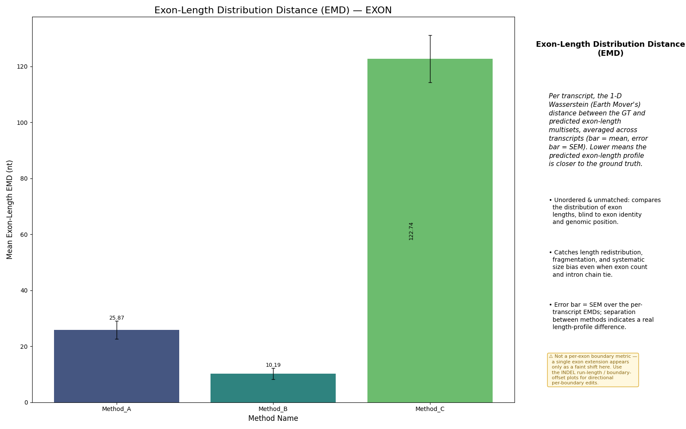
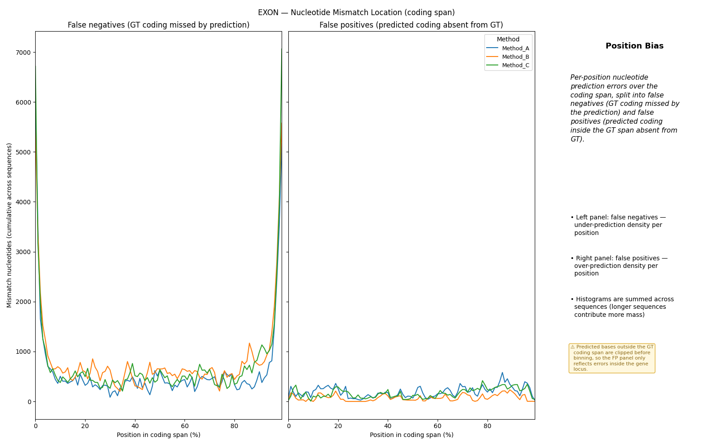

# Diagnostic Depth

Diagnostic Depth (`EvalMetrics.DIAGNOSTIC_DEPTH`) adds distribution-level and
positional diagnostics that complement the per-section metrics. It answers
*where* and *by how much* a prediction's structure diverges from the reference
— `length_emd` measures the magnitude of the length-distribution mismatch and
the position-bias histograms show where mismatches concentrate — rather than
scoring pass/fail. All outputs operate on the coding sections of the configured
`evaluation_scope`.

## Example Plots

Per-method mean exon-length EMD (bar = mean, error bar = SEM across transcripts).
Lower means the predicted exon-length profile is closer to the reference; the
SEM whiskers show whether a gap between methods is a real separation.

## What Is Computed

For each (GT, prediction) pair the benchmark records:

- `gt_segment_lengths` / `pred_segment_lengths` — the lengths (in nucleotides)
  of every GT and predicted coding segment.
- `length_emd` — the 1-D Wasserstein (Earth Mover's) distance between the GT and
  predicted segment-length distributions. It quantifies whether the model
  produces segments of the right length, independent of where they sit. It is
  computed per transcript and rendered as a per-method mean ± SEM bar (see the
  plot above).
- `position_bias_histogram_fn` / `position_bias_histogram_fp` — two 100-bin
  histograms of per-nucleotide mismatches, normalised to the GT coding span so
  that bin 0 is the start of the first GT coding segment and bin 99 the end of
  the last.

The two position-bias histograms are kept separate so under- and
over-prediction can be told apart:

| Histogram | Counts |
|---|---|
| `position_bias_histogram_fn` | GT coding positions **not** covered by the prediction (under-prediction) |
| `position_bias_histogram_fp` | Predicted coding positions inside the GT coding span that are **not** in GT (over-prediction) |

Predicted positions outside the GT coding span are clipped out, keeping each
histogram bounded to the gene locus.

## Interpretation

- `length_emd` near 0: predicted segment lengths match the reference
  distribution.
- FN mass concentrated near bin 0 / bin 99: the prediction systematically
  trims the terminal coding segments.
- broad FP mass: the prediction paints coding bases across the locus that the
  reference does not contain.

## Aggregation

Across sequences, segment-length lists are concatenated and the two histograms
are summed bin-wise before any summary statistic is taken (see
{doc}`conventions`). The online W&B subset logs `length_emd/mean` and
`length_emd/mae`.

## Caveats

- "Coding segment" is defined relative to the configured `evaluation_scope`
  positive-token set, so a `cds` run and a `transcript_exon` run produce
  different histograms.
- The histograms describe positional mismatch density, not transcript chain
  correctness — pair them with {doc}`structural_coherence`.
- `length_emd` is a distribution distance, not a per-exon boundary metric: it is
  unordered and unmatched, so a single exon extension shows only as a faint
  shift. Use the INDEL run-length / boundary-offset diagnostics for directional
  per-boundary edits.
