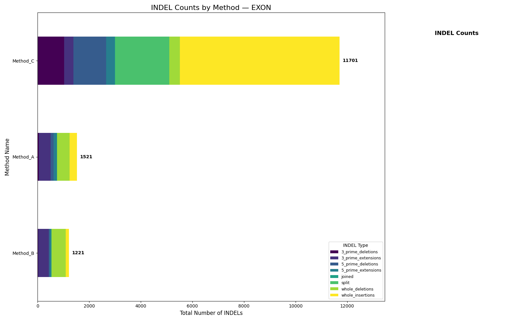
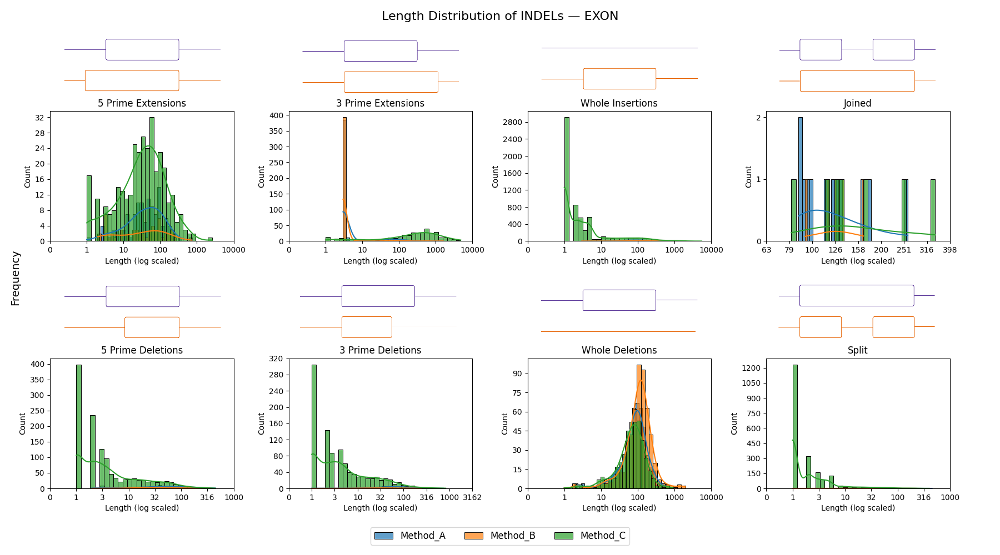

# INDEL

The INDEL family classifies contiguous coding mismatches into a structural
error taxonomy instead of reducing them to a single overlap score.

## Example Plot

The count plot shows which structural error types dominate. The length
distribution helps separate small boundary slips from long insertions, long
deletions, or broad merged/split regions.

## Categories

Insertions are regions where prediction has coding and GT does not:

- `5_prime_extensions`
- `3_prime_extensions`
- `joined`
- `whole_insertions`

Deletions are regions where GT has coding and prediction does not:

- `5_prime_deletions`
- `3_prime_deletions`
- `split`
- `whole_deletions`

## How Classification Works

The benchmark pads GT and prediction with one background position on both sides.
For each contiguous mismatch group, it checks whether the mismatch touches a
correct coding region immediately on the 5' side, the 3' side, both, or
neither.

That local neighborhood test drives the category:

- one touched side: extension or deletion at that end
- both touched sides: `joined` or `split`
- neither side: whole insertion or whole deletion

## Interpretation

- many `3_prime_extensions` or `3_prime_deletions`: systematic end-boundary
  problems
- many `joined`: the model tends to merge adjacent GT coding sections
- many `split`: the model fragments single GT coding sections
- many `whole_insertions`: strong hallucination behavior

## Caveats

- This taxonomy is coding-label specific.
- It is local. It classifies contiguous mismatch runs, not full transcript
  structure.
- The output is list-based and mainly intended for final inspection and
  plotting, not for lightweight online scalar logging.
