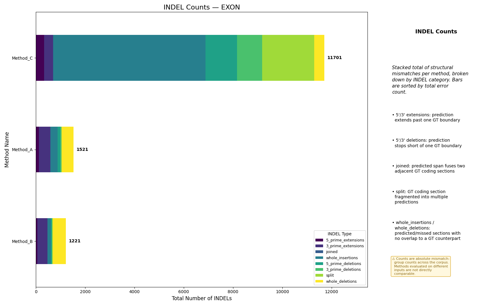
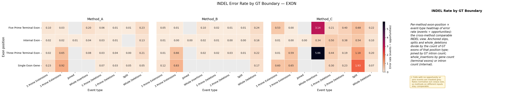
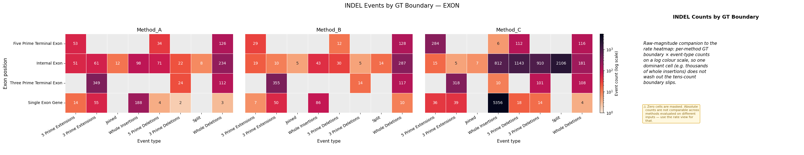
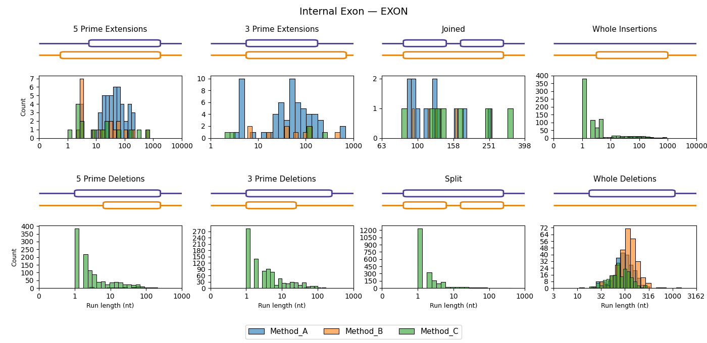
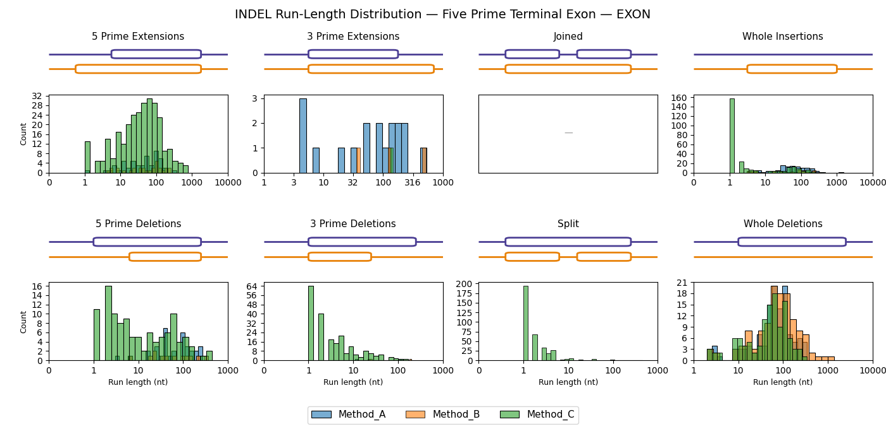
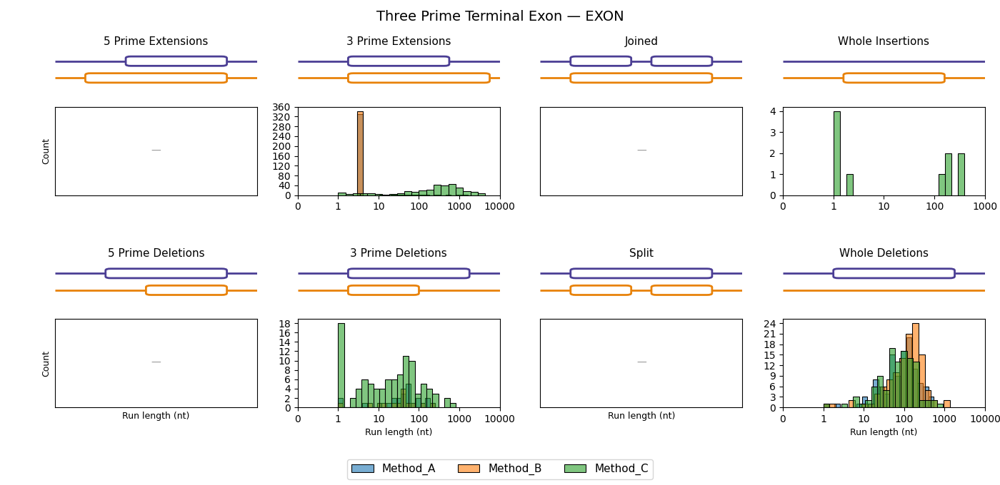
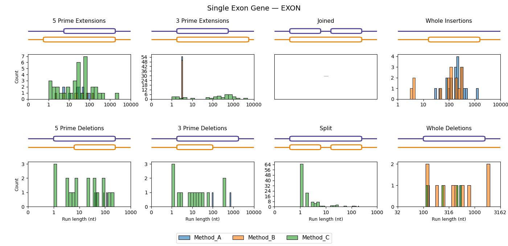

# INDEL

The INDEL family classifies contiguous coding mismatches into a structural
error taxonomy instead of reducing them to a single overlap score. Each
mismatch run is additionally **typed by the semantic position of the GT exon it
touches** — `five_prime_terminal_exon`, `internal_exon`,
`three_prime_terminal_exon`, or `single_exon_gene` — so a slip on a 5′-terminal
exon is kept separate from one on an internal exon even though both look
identical to the binary coding mask.

## Example Plots







Four complementary views are produced (all boundary-resolved views use one panel
**per method** over a shared, biologically-ordered grid, so methods compare
directly):

- **`indel_counts`** — per method, the total number of each structural error
  type (boundaries aggregated). Answers *which* error types dominate.
- **`indel_rates_by_boundary`** — the headline benchmarking view: a GT-boundary ×
  event-type **rate** heatmap (events ÷ opportunities; see *Rates* below).
  Colour = rate, cell annotation = raw count, grey = no opportunity. Answers
  *how reliably* each method handles each junction, comparably across methods and
  junction types.
- **`indel_counts_by_boundary`** — the raw-magnitude companion: the same grid
  coloured by event count on a **log** scale (so one huge cell does not wash out
  the rest). Answers *where* the errors concentrate in absolute terms.
- **`indel_lengths_<boundary>`** — one figure per exon-position category: a
  4 × 2 grid (insertions top row, deletions bottom row) of overlaid per-method
  run-length histograms. Answers *how large* the slips are at each junction,
  separating small boundary slips from long insertions/deletions or broad
  merge/split regions.

### Run-length distributions by exon position

**Internal exon**



**5′ terminal exon**



**3′ terminal exon**



**Single-exon gene**



## Categories

Insertions are runs where the prediction has coding and GT does not:

- `5_prime_extensions`
- `3_prime_extensions`
- `joined`
- `whole_insertions`

Deletions are runs where GT has coding and the prediction does not:

- `5_prime_deletions`
- `3_prime_deletions`
- `split`
- `whole_deletions`

## How Classification Works

The benchmark pads the GT and prediction coding masks with one background
position on both sides. For each contiguous mismatch run it checks whether the
run touches a *correct* coding region (coding in both GT and prediction)
immediately on the 5' side, the 3' side, both, or neither.

That local neighborhood test drives the event type:

- one touched side: extension or deletion at that end
- both touched sides: `joined` or `split`
- neither side: whole insertion or whole deletion

## Exon-Position Typing

On top of the event type, each run is keyed by the **semantic position of the GT
exon it touches**, one of four categories:

- `five_prime_terminal_exon`
- `internal_exon`
- `three_prime_terminal_exon`
- `single_exon_gene`

Each GT coding segment is typed once from the GT labels immediately flanking it
(`semantic_boundary_label`): a flank is *terminal* when it is outside the intron
chain (`NONCODING`, the sequence edge `none`, or a UTR label marking the
start/stop-codon boundary in UTR_CDS_INTRON mode); `INTRON` is the only
*internal* flank. Two terminal flanks → `single_exon_gene`; one terminal flank →
5′- or 3′-terminal exon; two intron flanks → `internal_exon`.

The run is then keyed by the GT exon it *affects*, not just its immediate flank:

- **deletions** are GT-coding throughout, so they key to the exon they sit on;
- **5′/3′ extensions** key to the adjacent GT exon they extend;
- **joins** bridge two exons across an intron → always `internal_exon`;
- **whole insertions** have no GT exon under them, so they key to the
  *predicted* exon they sit on (typed the same way from the prediction's flanks).

Because typing reads the flanks in **array (5'→3') order**, the 5′- and
3′-terminal categories stay distinct — a distinction a class-blind metric cannot
make, since UTR/non-coding appears at both ends of a gene. This is only
biologically meaningful under the standard 5'→3' input orientation
(see {doc}`conventions`).

## Output Structure

`eval_indel` returns

```python
{
    "by_boundary": {exon_type: {event_type: [run_length, ...]}},
    "exon_opportunities": {exon_type: int},  # GT exon count per position type
    "n_gt_segments": int,                    # GT coding segments
    "n_pred_segments": int,                  # predicted coding segments
}
```

`exon_type` is one of the four `SEMANTIC_BOUNDARY_ORDER` categories above. Only
run **lengths** (in nucleotides) are stored, not index arrays: that is all the
plots need, and it keeps the per-exon-type fan-out small. The semantic-type keys
are produced once, where `label_config` is available, so the same string keys
are used by the tests, the accumulator merge, the plots, and JSON output. The
denominators are summed across sequences by the accumulator.

## Rates and opportunities

Raw counts are not comparable across methods, test sets, or junction types
because they have no denominator. Each event is therefore divided by its
**opportunity** count to give a rate, with a denominator chosen per event family:

| event family | events | denominator (opportunity) | reads as |
|---|---|---|---|
| exon-anchored | 5'/3' extensions & deletions, `split`, `whole_deletions` | count of GT exons of that position type (`exon_opportunities[type]`) | fraction of that exon type that suffered the error |
| intron-anchored | `joined` | GT intron count (`n_gt_segments − n_genes`) | fraction of introns bridged |
| gene / intron | `whole_insertions` | gene count at a terminal exon, intron count internally; unbounded at `single_exon_gene` (masked) | fraction of that opportunity hallucinated |

`n_genes = #five_prime_terminal_exon + #single_exon_gene`; the plotter derives
gene and intron counts from `exon_opportunities` + `n_gt_segments`, which assumes
each evaluation window is one complete transcript (true under per-transcript
scoping).

This split is deliberate: exon-anchored slips measure *localization* of an exon
the method got roughly right, whereas `whole_*` events are *detection*
(presence/absence) — closer to recall (`whole_deletions`) and precision
(`whole_insertions`). The `indel_rates_by_boundary` plot colours by these rates;
cells with zero opportunity are masked.

## Interpretation

- many `3_prime_extensions` / `3_prime_deletions`: systematic end-boundary
  problems
- many `joined`: the model tends to merge adjacent GT coding sections
- many `split`: the model fragments single GT coding sections
- many `whole_insertions`: strong hallucination behavior
- a hotspot at one exon position in `indel_counts_by_boundary` (e.g.
  `internal_exon` 3'-deletions): the model consistently fails one specific exon
  type. Read it together with the state-transition *direction* (late vs
  premature) for the same boundary — INDEL gives the slip magnitude, transitions
  give the timing.

## Caveats

- This taxonomy is scope-specific. "Insertion" / "deletion" are defined
  relative to the configured `evaluation_scope` positive-token set (see
  {doc}`../getting_started/annotation_modes`). The event type comes from the
  binary coding mask; the **boundary type** then restores the GT label context
  (intron vs UTR vs background) that the mask discards.
- The exon-position key describes which GT (or, for whole insertions, predicted)
  exon a run touches, not its interior. A run whose interior spans several GT
  labels (e.g. a hallucinated coding stretch over UTR–intron–UTR) is typed by the
  single exon it anchors to, collapsing the internal structure.
- It is local. It classifies contiguous mismatch runs, not full transcript
  structure.
- 5'/3' and the boundary key order refer to **array orientation**, not
  biological strand. Minus-strand input in genomic coordinates would invert
  the labels. See {doc}`conventions`.
- The run-length distribution plots use a `log10` x-axis with tick labels
  re-projected to linear bp. A peak labelled "100" represents bins *near*
  100 bp, not exactly 100.
