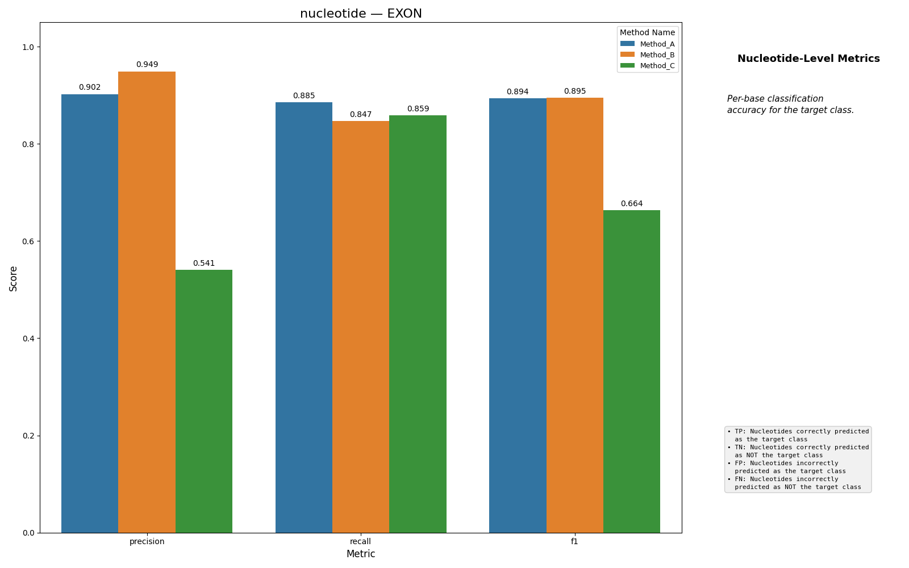

# Nucleotide Classification

Nucleotide Classification is the simplest metric family in the benchmark: it
collapses the task to coding label vs everything else and reports binary
classification quality per base.

## Example Plot

## What It Computes

The benchmark binarizes both arrays using `label_config.coding_label`:

- coding positions become `1`
- every other label becomes `0`

It then computes a 2x2 confusion matrix and aggregates:

- precision
- recall
- F1

The raw counts are `tn`, `fp`, `fn`, and `tp`. Those are converted to
user-facing summary statistics during aggregation.

## Interpretation

This family is useful when you care about coding occupancy more than exact
structure.

- high values here and weak structural metrics: the model often paints coding
  nucleotides in roughly the right places, but gets segmentation wrong
- low values here and weak structural metrics: the model is missing coding
  content entirely or hallucinating it broadly

## Caveats

- This is not a multi-class confusion metric across all labels. It is coding
  vs not-coding.
- It is easier to optimize than section-level and transcript-level metrics.
  Good nucleotide F1 does not imply good transcript structure.
- For splice-site-heavy label sets, this family hides whether mistakes come
  from exon/intron confusion or splice-label confusion, because everything
  outside the coding label is folded into the negative class.
