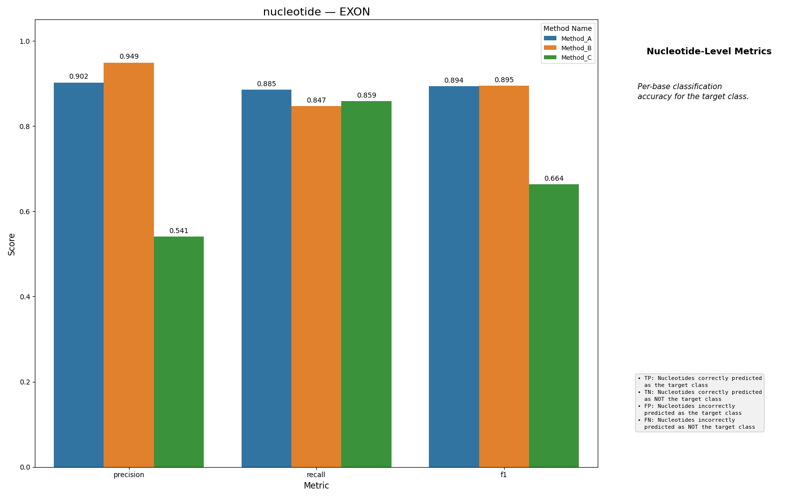

# Nucleotide Classification

Nucleotide Classification is the simplest metric family in the benchmark: it
collapses the task to in-scope vs everything else and reports binary
classification quality per base.

## Example Plot

## What It Computes

The benchmark binarizes both arrays using the configured `evaluation_scope`
(see {doc}`../getting_started/annotation_modes`):

- positions whose label is in the scope's positive-token set become `1`
  (`exon` in `EXON_INTRON`; `5' UTR + CDS + 3' UTR` for the `transcript_exon`
  scope, or `CDS` only for the `cds` scope in `UTR_CDS_INTRON`)
- every other label becomes `0`

It then computes a 2x2 confusion matrix and aggregates:

- precision
- recall
- F1

The raw counts are `tn`, `fp`, `fn`, and `tp`. Those are converted to
user-facing summary statistics during aggregation.

## Interpretation

This family is useful when you care about in-scope occupancy more than exact
structure.

- high values here and weak structural metrics: the model often paints in-scope
  nucleotides in roughly the right places, but gets segmentation wrong
- low values here and weak structural metrics: the model is missing in-scope
  content entirely or hallucinating it broadly

## Caveats

- This is not a multi-class confusion metric across all labels. It is in-scope
  vs out-of-scope.
- It is easier to optimize than section-level and transcript-level metrics.
  Good nucleotide F1 does not imply good transcript structure.
- For splice-site-heavy label sets, this family hides whether mistakes come
  from exon/intron confusion or splice-label confusion, because everything
  outside the scope is folded into the negative class.
- Aggregation is **micro-averaged** across sequences: per-sequence `tp`,
  `fp`, `fn`, `tn` are summed before the ratio is taken, so longer
  sequences dominate the corpus score. See {doc}`conventions` for
  details.
- The scope's positive-token set is always non-empty, so the metric always
  produces a `nucleotide` confusion block when requested.
