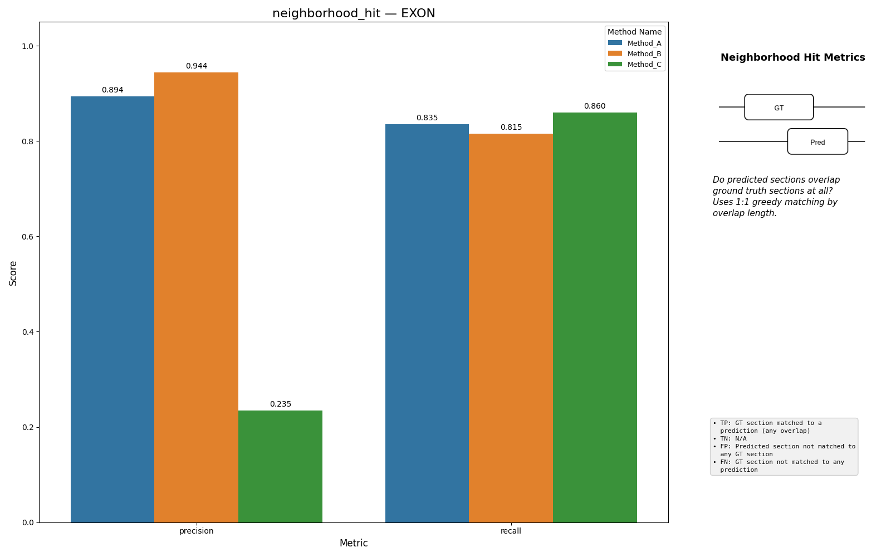
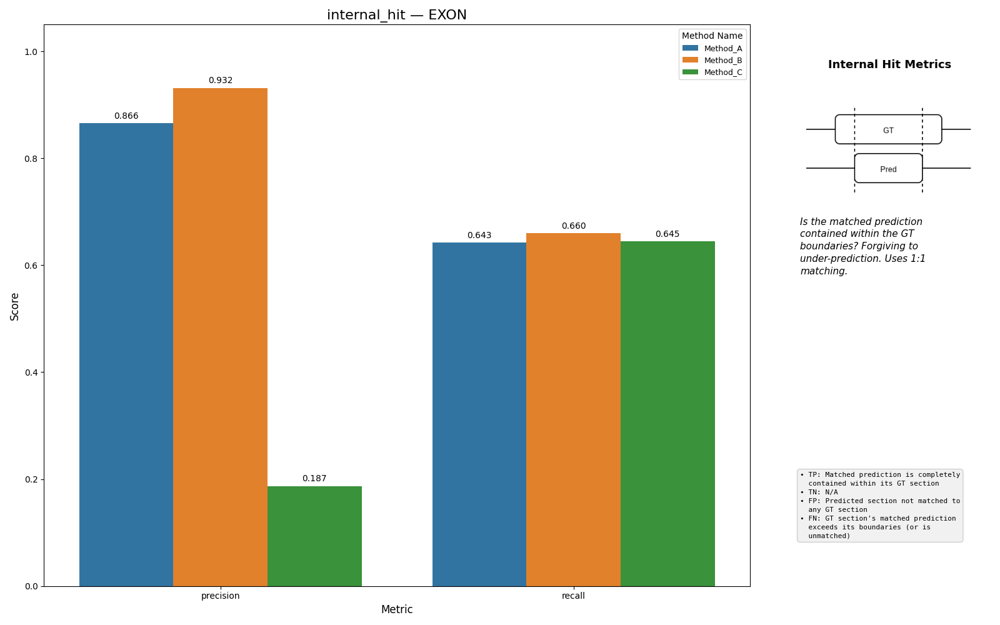
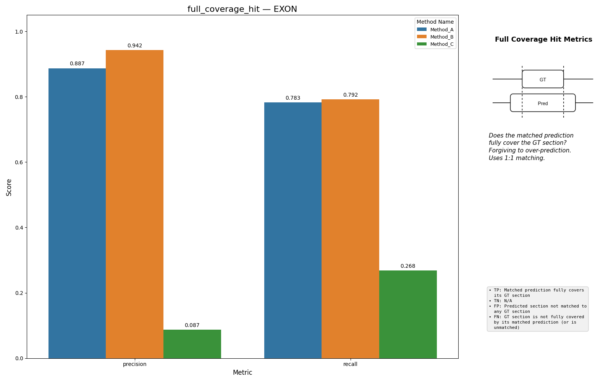
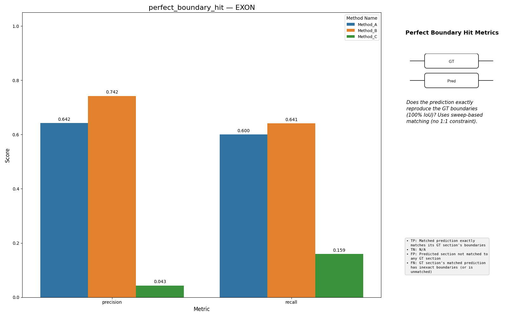

# Region Discovery

Region Discovery answers a section-level question: did the predictor recover
the right coding runs, independent of fine-grained boundary residuals?

## How Sections Are Matched

The benchmark first extracts contiguous GT and predicted coding sections. It
then finds all overlapping `(GT, pred)` pairs and sorts them by overlap
length. A greedy 1:1 assignment claims the largest overlaps first.

For `neighborhood_hit`, `internal_hit`, and `full_coverage_hit`, each GT
section can be matched to at most one prediction and each prediction can be
matched to at most one GT section.

`perfect_boundary_hit` is different: it uses a sweep over all sections and
counts any exact-boundary match, without the 1:1 assignment.

## The Four Levels

### `neighborhood_hit`

True positive if the matched prediction overlaps the GT section at all.

This is the most forgiving tier. Any contact counts.

### `internal_hit`

True positive if the matched prediction lies entirely inside the GT section.

This forgives under-prediction of the GT span less than
`full_coverage_hit`, but it treats over-extended predictions as failures.

### `full_coverage_hit`

True positive if the matched prediction fully covers the GT section.

This is the converse of `internal_hit`: it forgives over-prediction but not
under-prediction.

### `perfect_boundary_hit`

True positive only when both boundaries match exactly.

Unlike the other three tiers, this one is sweep-based rather than 1:1 matched.
That prevents fragmented predictions from being miscounted purely because one
fragment already claimed a GT section in the greedy assignment.

## Double-Penalty Behavior

This family intentionally uses GT sections and prediction sections as separate
objects. When one GT section is split into two predictions, or two GT sections
are merged into one prediction, you often get both:

- a false negative on the GT side
- a false positive on the prediction side

That is the right behavior if you want structural section recovery rather than
base-level overlap alone. The metric is penalizing both the missed GT section
and the extra unmatched predicted section.

## Interpretation

- high `neighborhood_hit`, low `perfect_boundary_hit`: the model usually finds
  the right locus but misses exact boundaries
- high `internal_hit`, lower `full_coverage_hit`: predictions tend to be too
  short
- high `full_coverage_hit`, lower `internal_hit`: predictions tend to be too
  long

## Caveats

- These metrics are coding-section metrics. They do not use intron labels.
- They are not transcript-chain metrics. Two transcripts can have good section
  discovery while still failing strict structural coherence.
- `perfect_boundary_hit` is stricter and structurally different from the other
  three tiers because it is not based on the greedy 1:1 assignment.
