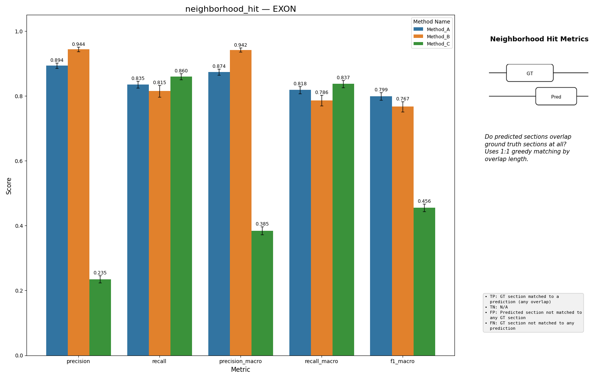
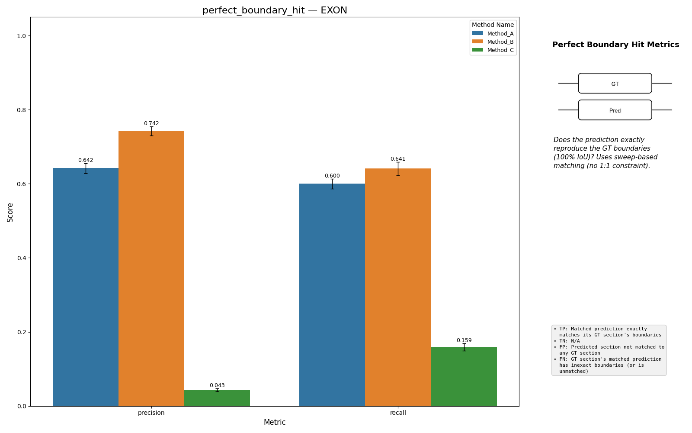

# Region Discovery

Region Discovery answers a section-level question: did the predictor recover
the right coding runs, independent of fine-grained boundary residuals?

## How Sections Are Matched

The benchmark first extracts contiguous GT and predicted coding sections. It
then finds all overlapping `(GT, pred)` pairs and sorts them by overlap
length. A greedy 1:1 assignment claims the largest overlaps first.

`perfect_boundary_hit` is different: it uses a sweep over all sections and
counts any exact-boundary match, without the 1:1 assignment.

## Output Structure

Region Discovery produces three outputs:

| Output | Type | Question answered |
|---|---|---|
| `neighborhood_hit` | precision / recall | Did we detect the region at all? |
| `perfect_boundary_hit` | precision / recall | Did we reproduce exact boundaries? |
| `containment` | conditional rates | Among detected regions, how tight are the boundaries? |

`neighborhood_hit` and `perfect_boundary_hit` are coherent contingency tables
(TP + FN = total GT, TP + FP = total pred). `containment` is explicitly a
rate — not precision/recall — with a stated denominator.

## The Two P/R Tiers

### `neighborhood_hit`

TP if the matched prediction overlaps the GT section at all.

This is the most forgiving detection tier. Any contact counts.

### `perfect_boundary_hit`

TP only when both boundaries match exactly.

Unlike `neighborhood_hit`, this tier is sweep-based rather than 1:1 matched.
That prevents fragmented predictions from being miscounted purely because one
fragment already claimed a GT section in the greedy assignment.

## Containment Rates

`containment` answers a conditional question: **among the pairs that were
matched by the greedy 1:1 assignment, how often does the prediction satisfy a
stricter spatial criterion?**

The denominator is `matched` — the neighborhood TP count — which equals
`neighborhood_hit.TP`. Rates are computed at summary time by micro-averaging
the integer counts across all sequences.

| Rate | Criterion |
|---|---|
| `internal_rate` | Prediction lies entirely inside the GT boundary |
| `full_coverage_rate` | Prediction fully covers the GT boundary |

When `matched == 0` (no regions detected at all), both rates are `None`.

### Why rates, not precision/recall?

A matched prediction that fails the containment criterion (e.g. it overlaps
but is slightly too large for `internal_rate`) is neither a spurious prediction
nor an additional missed GT — it has already been accounted for in
`neighborhood_hit`. Treating it as both a false negative and as the residual
FP count that was used for `neighborhood_hit` precision produces a confusion
table that does not close. Reporting conditional rates avoids this by using a
well-defined denominator (the number of matched pairs) rather than the full
prediction or GT counts.

## Double-Penalty Behavior

`neighborhood_hit` and `perfect_boundary_hit` intentionally use GT sections
and prediction sections as separate objects. When one GT section is split into
two predictions, or two GT sections are merged into one prediction, you often
get both:

- a false negative on the GT side
- a false positive on the prediction side

That is the right behavior if you want structural section recovery rather than
base-level overlap alone.

## Interpretation

- high `neighborhood_hit`, low `perfect_boundary_hit`: the model usually finds
  the right locus but misses exact boundaries
- low `containment.internal_rate`, high `containment.full_coverage_rate`:
  predictions tend to be too long (over-extended)
- high `containment.internal_rate`, low `containment.full_coverage_rate`:
  predictions tend to be too short (under-extended)
- both containment rates near 1: matched predictions are close to exact even
  when `perfect_boundary_hit` is lower (fragmentation effect)

## Caveats

- These metrics are coding-section metrics. They do not use intron labels.
- They are not transcript-chain metrics. Two transcripts can have good section
  discovery while still failing strict structural coherence.
- `perfect_boundary_hit` TP/FP/FN counts come from the sweep, so absolute
  counts are not directly comparable to the matched `neighborhood_hit` tier.
- Aggregation is micro-averaged across sequences (see {doc}`conventions`):
  per-sequence integer counts are summed before ratios are computed, so long
  sequences dominate the corpus score.
