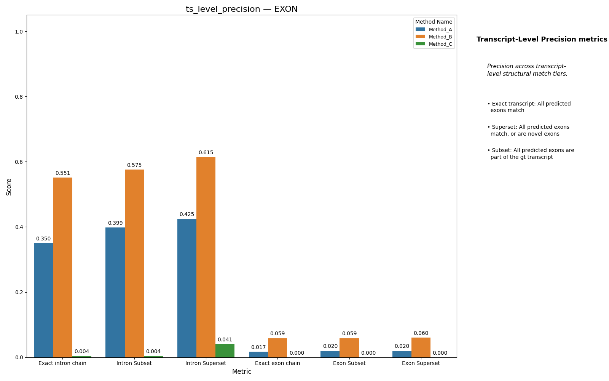
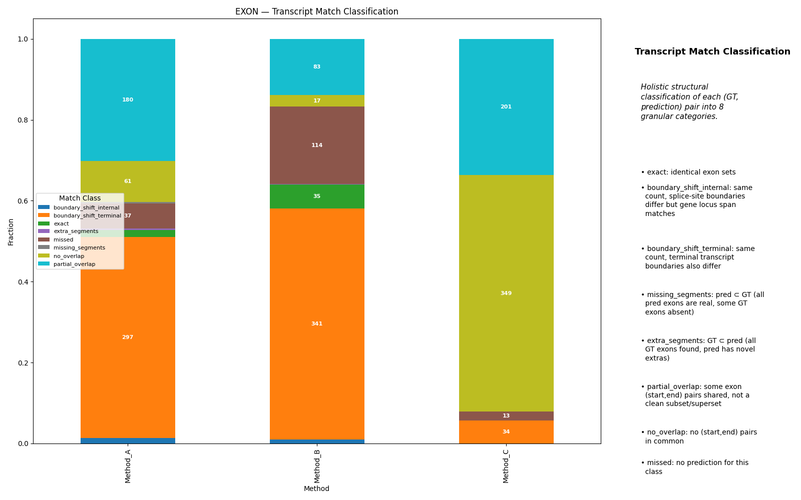
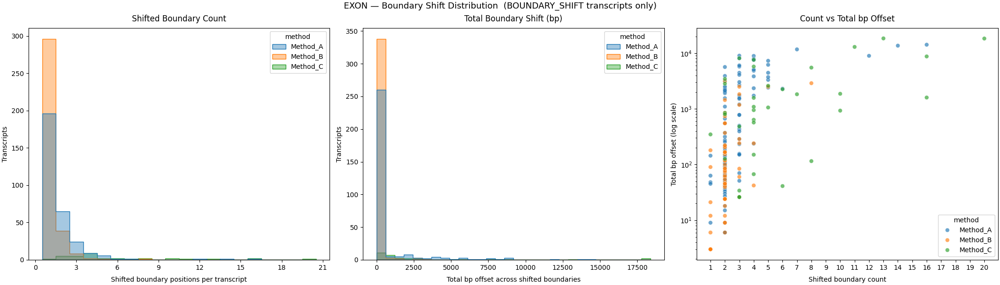
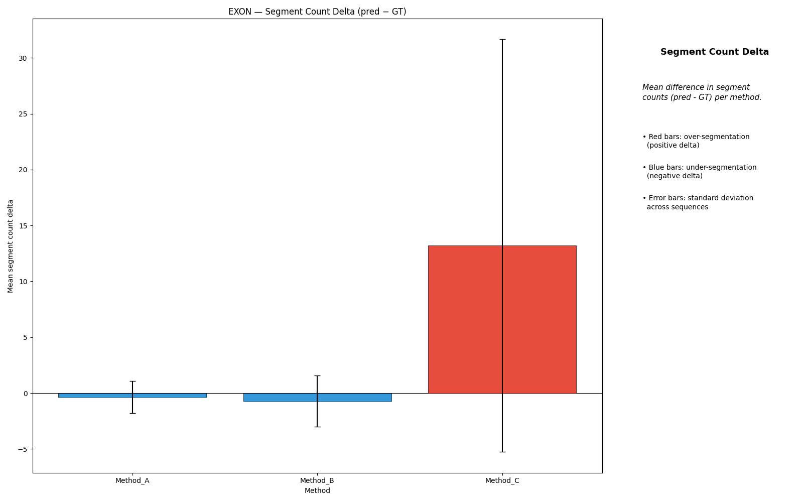
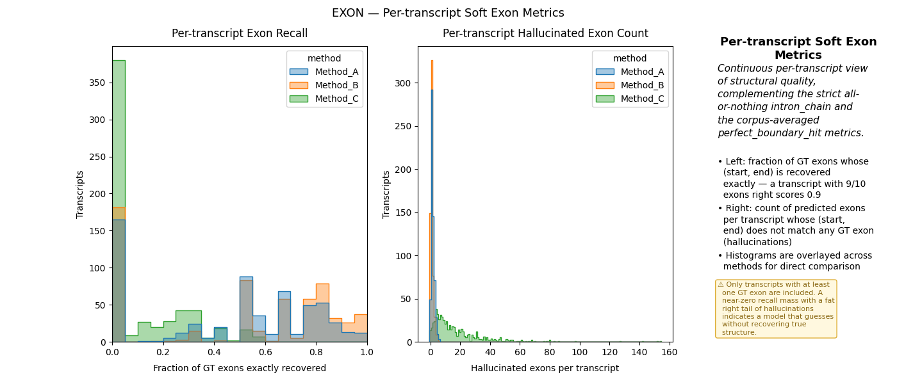

# Structural Coherence

Structural Coherence evaluates transcript structure as a whole rather than one
coding section at a time. It focuses on whether a predicted set of coding
segments (exons/CDS) and the implicit intron boundaries form the same
transcript-level structure as the ground truth.

---

## Intron/Exon Chain Precision and Recall

Chain metrics measure whether the complete set of intron or exon boundaries in
a predicted transcript matches the ground truth. For each chain type the
benchmark reports three sibling metrics:

- `{chain}` — strict exact-match: true only when the predicted boundary set
  equals the GT boundary set exactly (e.g. `intron_chain`, `exon_chain`).
- `{chain}_subset` — true when the predicted set is a subset of GT (every
  predicted boundary exists in GT). This is precision-oriented: it penalises
  hallucinated boundaries.
- `{chain}_superset` — true when the predicted set is a superset of GT (every
  GT boundary is recovered). This is recall-oriented: it penalises missed
  boundaries.

For a single (GT, prediction) pair the strict metric is all-or-nothing:

- `tp = 1` only if the GT set equals the prediction set exactly
- otherwise `fp = 1` and `fn = 1`

Aggregation converts those raw counts into corpus-level precision and recall.

**Important:** if a structure contains multiple coding segments but no explicit
intron-label segments, intron-chain scoring raises an error rather than
silently assuming there are no introns. Either provide explicit intron labels or
enable intron inference at the public entry points (e.g. pass
`infer_introns=True` to `benchmark_gt_vs_pred_single` /
`benchmark_gt_vs_pred_multiple`).

---

## Transcript Classifications

Each (GT, prediction) pair is assigned one holistic structural class that
summarises how the predicted transcript structure relates to the ground truth.

| Class | Description |
|---|---|
| `exact` | Identical sets of `(start, end)` coding segments. |
| `boundary_shift_internal` | Same segment count and outer locus boundaries match, but one or more internal splice-site boundaries differ. |
| `boundary_shift_terminal` | Same segment count but one or both terminal (gene-locus start/end) boundaries differ. |
| `missing_segments` | Every predicted segment exists in GT (pred ⊂ GT) but some GT segments are absent — under-calling. |
| `extra_segments` | Every GT segment is found in the prediction (GT ⊂ pred) but the prediction adds novel segments — over-calling. |
| `partial_overlap` | At least one `(start, end)` pair is shared but the sets are neither equal nor in a subset relationship. Captures collapsed or heavily altered structures. |
| `no_overlap` | No `(start, end)` pair is shared between GT and prediction. |
| `missed` | The prediction contains no segments for this transcript. |

The two boundary-shift variants distinguish internal splice-site errors from
changes that alter the reported gene-locus boundaries — a useful split because
terminal boundary errors often reflect UTR ambiguity rather than splicing
errors.

### Representative examples

**Exact match**
- GT exons: `(100-180) (260-340) (420-500)`
- Pred exons: `(100-180) (260-340) (420-500)`
- Class: `exact`

**Splice-site shift (internal)**
- GT exons: `(100-180) (260-340) (420-500)`
- Pred exons: `(100-180) (255-345) (420-500)`
- Class: `boundary_shift_internal` — count unchanged, one internal boundary pair displaced.

**Skipped middle exon**
- GT exons: `(100-180) (260-340) (420-500)`
- Pred exons: `(100-180) (420-500)`
- Class: `missing_segments` — transcript marked incomplete; Region Discovery may still give partial credit for retained exons.

**Spurious extra exon**
- GT exons: `(100-180) (260-340) (420-500)`
- Pred exons: `(100-180) (260-340) (360-390) (420-500)`
- Class: `extra_segments`

**Collapsed or heavily altered structure**
- GT exons: `(100-180) (260-340) (420-500)`
- Pred exons: `(100-210) (300-360) (420-500)`
- Class: `partial_overlap` — neither a clean subset/superset nor a pure boundary shift.

**Missed transcript**
- GT exons: `(100-180) (260-340) (420-500)`
- Pred exons: none
- Class: `missed` — yields zero exon recall for that transcript.

---

## Boundary Shift Distribution

For transcripts where GT and prediction have the same number of segments (i.e.
transcripts classified as `boundary_shift_internal` or
`boundary_shift_terminal`), the benchmark records two per-transcript values:

- `boundary_shift_count` — the number of individual boundary positions
  (segment starts and ends) that differ between GT and prediction.
- `boundary_shift_total` — the cumulative base-pair offset summed across all
  shifted boundaries in that transcript.

These are only meaningful when segment counts match; if they differ both values
are reported as 0 and the transcript is excluded from the distribution plots.

The three sub-panels show:

- **Shifted Boundary Count** — how many boundary positions per transcript are
  displaced. A value of 1 means only one splice site is off; higher values
  indicate widespread boundary inaccuracy within an otherwise correctly-counted
  transcript.
- **Total Boundary Shift (bp)** — the total nucleotide offset across all
  shifted boundaries. A transcript with a small count but large total shift has
  a single severely displaced boundary; a large count with a small total shift
  has many minor displacements.
- **Count vs Total bp Offset** (log scale) — the joint distribution, useful for
  separating methods that produce many small shifts from those that produce few
  large ones.

---

## Segment Count Delta

`segment_count_delta = pred_count − gt_count`

This metric captures systematic over- or under-segmentation across the
predicted transcriptome.

- Positive values indicate over-segmentation (the predictor splits GT segments
  into more pieces than exist in the reference).
- Negative values indicate under-segmentation (the predictor merges or omits
  GT segments).
- Zero means the predicted segment count matches GT on average.

After aggregation the metric is summarised with mean and spread (rather than a
single raw count) to expose both the direction and the consistency of the bias.

---

## Soft Exon Metrics

The strict chain score is deliberately all-or-nothing. The soft exon metrics
add a distributional view that quantifies *how far off* a prediction is even
when the strict score fails.

### Exon recall per transcript

`exon_recall_per_transcript` is the fraction of GT exons that are recovered
exactly in the prediction, computed per (GT, prediction) pair and then
summarised across the corpus.

A value of 1.0 means every GT exon boundary was reproduced exactly. Lower
values indicate how many GT exons are systematically missed, regardless of
whether the overall chain score is a pass or fail.

### Hallucinated exon count per transcript

`hallucinated_exon_count_per_transcript` is the number of predicted exons that
have no exact counterpart in the GT set, computed per transcript pair.

Higher values indicate that the predictor invents exon boundaries not present
in the reference. Note that this count is independent of recall: a method can
simultaneously recover all GT exons (high recall) while also hallucinating
additional ones (high hallucination count).

### Reading the two metrics together

| Exon recall | Hallucinated count | Interpretation |
|---|---|---|
| High | Low | Mostly correct transcript recovery. |
| High | High | GT structure is covered but the predictor also invents extra exons. |
| Low | Low | Conservative under-calling — few false exons but many GT exons missed. |
| Low | High | Heavily incorrect predictions: both missing GT exons and spurious new ones. |

---

## Caveats

- `intron_chain` requires intron labels or `infer_introns=True` when introns
  should be inferred from coding gaps.
- Good Region Discovery scores do not guarantee good Structural Coherence. A
  model can recover many individual sections while still assembling the wrong
  transcript chain.
- Soft exon metrics operate on exact coding-segment boundaries, not fuzzy
  overlaps.
