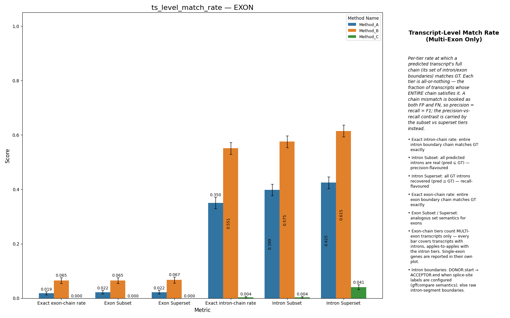
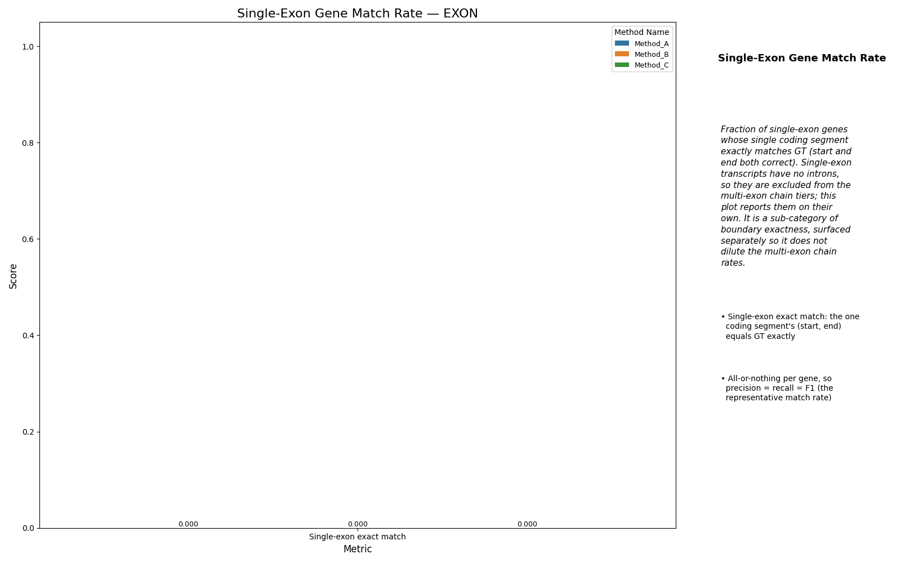
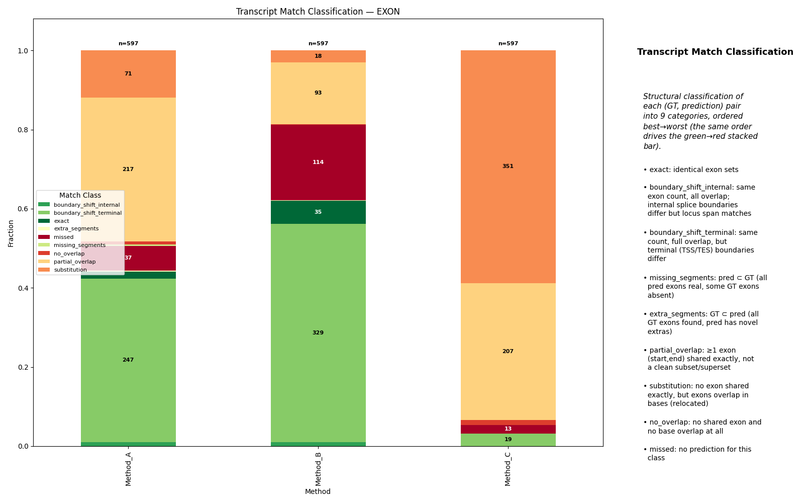
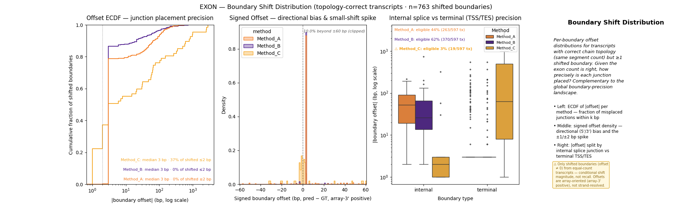
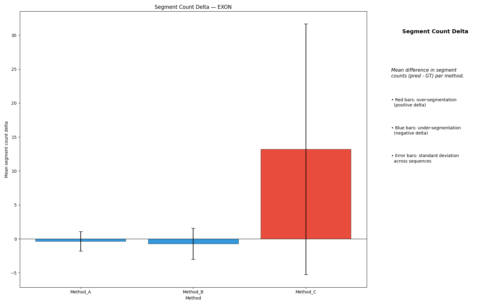
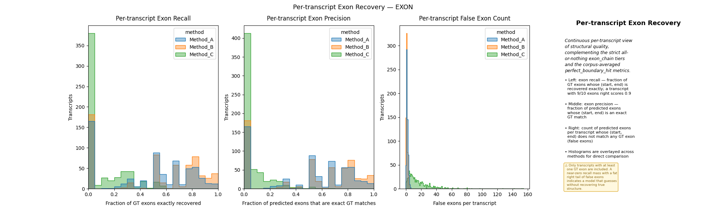
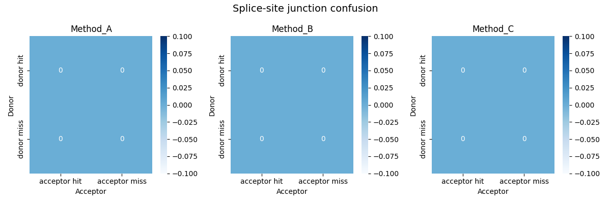
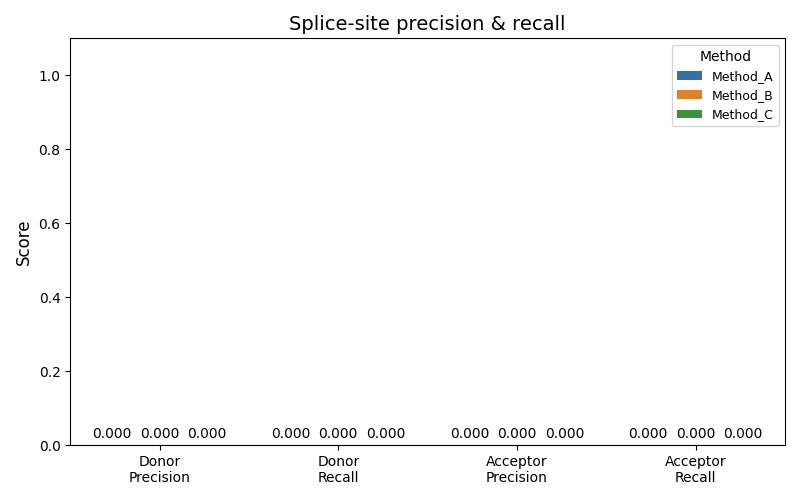

# Structural Coherence

Structural Coherence evaluates transcript structure as a whole rather than one
coding section at a time. It focuses on whether a predicted set of coding
segments (exons/CDS) and the implicit intron boundaries form the same
transcript-level structure as the ground truth.

---

## Intron/Exon Chain Match Rate (Multi-Exon Only)

Chain metrics measure whether the complete set of intron or exon boundaries in
a predicted transcript matches the ground truth. For each chain type the
benchmark reports three sibling metrics:

- `{chain}` — strict exact-match: true only when the predicted boundary set
  equals the GT boundary set exactly (e.g. `intron_chain`, `exon_chain`).
- `{chain}_subset` — true when the predicted set is a subset of GT (every
  predicted boundary exists in GT). This is precision-oriented: it penalises
  hallucinated boundaries.
- `{chain}_superset` — true when the predicted set is a superset of GT (every
  GT boundary is recovered). This is recall-oriented: it penalises missed
  boundaries.

**Population scope:** the exon-chain tiers (`exon_chain_multi`,
`exon_chain_multi_subset`, `exon_chain_multi_superset`) cover **multi-exon
transcripts only**, keeping them apples-to-apples with the intron-chain tiers
(which are inherently multi-exon). Single-exon genes are reported separately
— see [Single-Exon Match Rate](#single-exon-gene-match-rate) below.

For a single (GT, prediction) pair the strict metric is all-or-nothing:

- `tp = 1` only if the GT set equals the prediction set exactly
- otherwise `fp = 1` and `fn = 1`

Aggregation converts those raw counts into corpus-level precision and
recall (micro-averaged: counts are summed across sequences before the
ratio is taken).

### Why a single rate (precision = recall = F1)

Because a chain mismatch is booked as **both** a false positive and a false
negative, every transcript contributes either `tp=1` (exact match) or
`fp=1, fn=1` (anything else). Summed across the corpus this forces `FP == FN`
exactly, so:

- precision `= TP / (TP + FP)` and recall `= TP / (TP + FN)` come out identical,
  and
- the bootstrap resamples `FP` and `FN` with the same indices, so even their
  standard errors coincide.

Precision and recall therefore carry no independent information for these
all-or-nothing tiers — they are the same number (and equal to F1). Reporting
them as two separate plots produced the same figure twice, so the benchmark
collapses them into a single per-tier **match rate**. The precision-vs-recall
question you actually care about is answered by the tiers themselves:
`{chain}_subset` is the precision-flavoured view (penalises false
boundaries) and `{chain}_superset` is the recall-flavoured view (penalises
missed boundaries).

### Empty-prediction handling

The subset and superset variants treat the empty prediction case
explicitly: an empty prediction is **not** vacuously a subset of GT.
The check requires the predicted set to be non-empty *and* satisfy the
set relation. So a transcript with no predicted segments scores
`{tp: 0, fp: 1, fn: 1}` in every chain variant.

If the GT set itself is empty (no segments of this class for the
sequence), the chain comparison contributes nothing — `{tp: 0, fp: 0,
fn: 0}` — so transcripts without coding segments do not artificially
inflate or deflate the corpus precision/recall.

**Important:** if a structure contains multiple coding segments but no explicit
intron-label segments, intron-chain scoring raises an error rather than
silently assuming there are no introns. Either provide explicit intron labels or
enable intron inference at the public entry points (e.g. pass
`infer_introns=True` to `benchmark_gt_vs_pred_single` /
`benchmark_gt_vs_pred_multiple`).

---

## Single-Exon Gene Match Rate

Single-exon transcripts have no introns, so they are excluded from all
chain-tier plots above. The single-exon match rate reports how often the one
coding segment's `(start, end)` matches GT exactly — an all-or-nothing
boundary check surfaced in its own plot so it does not dilute the multi-exon
chain rates.

Because a chain mismatch is booked as both FP and FN, precision = recall = F1
here too; one representative match rate is reported per method.

The key accumulated is `exon_chain_single`; single-exon pairs contribute
nothing to `exon_chain_multi*` and vice versa.

---

## Transcript Classifications

Each (GT, prediction) pair is assigned one holistic structural class that
summarises how the predicted transcript structure relates to the ground truth.

| Class | Description |
|---|---|
| `exact` | Identical sets of `(start, end)` coding segments. |
| `boundary_shift_internal` | Same segment count **and** every predicted segment overlaps its positional GT counterpart; outer locus boundaries match, but one or more internal splice-site boundaries differ. |
| `boundary_shift_terminal` | Same segment count and full pairwise overlap, but one or both terminal (gene-locus start/end) boundaries differ. |
| `missing_segments` | Every predicted segment exists in GT (pred ⊂ GT) but some GT segments are absent — under-calling. |
| `extra_segments` | Every GT segment is found in the prediction (GT ⊂ pred) but the prediction adds novel segments — over-calling. |
| `partial_overlap` | At least one `(start, end)` pair is shared exactly but the sets are neither equal nor in a subset relationship. Captures collapsed or heavily altered structures. |
| `substitution` | No `(start, end)` pair is shared exactly, yet at least one predicted segment overlaps a GT segment in base coordinates — relocated or substituted exons. |
| `no_overlap` | No segment is shared exactly **and** no base-coordinate overlap exists between GT and prediction. |
| `missed` | The prediction contains no segments for this transcript (and GT does have segments). |

If GT itself has no segments of this class the transcript is excluded
from the match-class distribution rather than counted as `missed` —
otherwise an empty reference would be reported as a prediction
failure.

The two boundary-shift variants distinguish internal splice-site errors from
changes that alter the reported gene-locus boundaries — a useful split because
terminal boundary errors often reflect UTR ambiguity rather than splicing
errors.

### Representative examples

**Exact match**
- GT exons: `(100-180) (260-340) (420-500)`
- Pred exons: `(100-180) (260-340) (420-500)`
- Class: `exact`

**Splice-site shift (internal)**
- GT exons: `(100-180) (260-340) (420-500)`
- Pred exons: `(100-180) (255-345) (420-500)`
- Class: `boundary_shift_internal` — count unchanged, one internal boundary pair displaced.

**Skipped middle exon**
- GT exons: `(100-180) (260-340) (420-500)`
- Pred exons: `(100-180) (420-500)`
- Class: `missing_segments` — transcript marked incomplete; Region Discovery may still give partial credit for retained exons.

**Spurious extra exon**
- GT exons: `(100-180) (260-340) (420-500)`
- Pred exons: `(100-180) (260-340) (360-390) (420-500)`
- Class: `extra_segments`

**Collapsed or heavily altered structure**
- GT exons: `(100-180) (260-340) (420-500)`
- Pred exons: `(100-210) (300-360) (420-500)`
- Class: `partial_overlap` — neither a clean subset/superset nor a pure boundary shift.

**Missed transcript**
- GT exons: `(100-180) (260-340) (420-500)`
- Pred exons: none
- Class: `missed` — yields zero exon recall for that transcript.

---

## Boundary Shift Distribution

For transcripts where GT and prediction have the same number of segments (i.e.
transcripts classified as `boundary_shift_internal` or
`boundary_shift_terminal`), the benchmark records both a per-transcript summary
and the individual per-boundary offsets:

- `boundary_shift_count` — the number of individual boundary positions
  (segment starts and ends) that differ between GT and prediction.
- `boundary_shift_total` — the cumulative base-pair offset summed across all
  shifted boundaries in that transcript.
- `boundary_shift_offsets` — one record per **shifted** boundary, carrying its
  signed `offset` (`pred − gt` in array coordinates; positive means the edge
  moved to the right / array-3') and a `position` tag of `internal` (an interior
  splice junction) or `terminal` (the transcript's outer start/end, i.e.
  TSS/TES in array orientation).

These are only meaningful when segment counts match; if they differ all three
are empty/zero and the transcript is excluded from the distribution plots. Note
the conditioning: this view only describes transcripts whose **chain topology is
already correct**, so it isolates junction-placement precision from the separate
question of recovering the right exons. That makes it complementary to — not a
duplicate of — the global [boundary precision landscape](boundary_exactness.md),
which pools every overlapping section pair regardless of topology.

> **Read eligibility before precision.** Because the distribution is
> conditioned on topology-correct transcripts *and* only records boundaries
> that actually differ (exact, offset-0 junctions are dropped), a method that
> recovers correct topology for only a handful of easy transcripts can still
> show a tight, flattering offset distribution. The offset panels therefore say
> nothing about *how many* transcripts a method got right. To stop this being
> misread, the figure carries the denominator alongside the offsets: a
> leftmost transcript-match classification bar, and a per-method **eligibility**
> caption (the share of GT transcripts the panels are conditioned on, flagged
> ⚠ when below 25 %). Always read those together with the boxes — and consult
> the unconditional splice-site precision/recall and confusion plots for the
> full-recall picture.

The four panels show:

- **Transcript match classes** (leftmost) — the severity-graded
  classification stacked bar (see above), repeated here as the *denominator*
  for the offset panels. The eligible (topology-correct) classes `exact` /
  `boundary_shift_internal` / `boundary_shift_terminal` are what the remaining
  panels are conditioned on.
- **Offset ECDF** (log x) — the cumulative distribution of `|offset|` per
  method, read as "fraction of *shifted* junctions within *k* bp". The
  per-method median offset and the percentage of shifted boundaries within
  ±2 bp are annotated (exact junctions are excluded upstream, so this is not an
  overall junction-accuracy rate). Because it is a cumulative *fraction*,
  methods with very different numbers of shifted boundaries remain directly
  comparable. The dotted line marks the ±2 bp reference.
- **Signed Offset** density — the signed offset over a robust window
  (the central ~98 % of the data; the clipped tail fraction is annotated). It
  exposes the heavy ±1/±2 bp spike typical of off-by-one splice-site errors and
  any directional bias: a histogram skewed right of zero indicates predicted
  edges systematically shifted toward array-3'.
- **Internal vs Terminal** (log y) — `|offset|` split by boundary type.
  Internal splice junctions are precisely defined (GT–AG dinucleotides) and
  should be tight; terminal TSS/TES boundaries are inherently fuzzy. Separating
  them prevents transcript-end uncertainty from masking (or being mistaken for)
  genuine splice-site imprecision. This panel is overlaid with the per-method
  **eligibility** caption (topology-correct share, ⚠ below 25 %) so the boxes
  are always read against the size of the population they summarise.

> **Strand note.** Offsets use array orientation (lower index = array-5'), not
> biological strand, so on the minus strand array-5'/3' correspond to the
> biological 3'/5' ends. A biological donor/acceptor decomposition is therefore
> deferred until minus-strand arrays are reverse-complemented upstream; the
> internal/terminal split above is strand-agnostic and unaffected.

---

## Segment Count Delta

`segment_count_delta = pred_count − gt_count`

This metric captures systematic over- or under-segmentation across the
predicted transcriptome.

- Positive values indicate over-segmentation (the predictor splits GT segments
  into more pieces than exist in the reference).
- Negative values indicate under-segmentation (the predictor merges or omits
  GT segments).
- Zero means the predicted segment count matches GT on average.

After aggregation the metric is summarised with mean and spread (rather than a
single raw count) to expose both the direction and the consistency of the bias.

---

## Exon Recovery

The strict chain score is deliberately all-or-nothing. The exon-recovery metrics
add a distributional view that quantifies *how far off* a prediction is even
when the strict score fails. Matching is still exact `(start, end)` identity —
the gradation is in the fraction matched, not in any boundary tolerance.

### Exon recall per transcript

`exon_recall_per_transcript` is the fraction of GT exons that are recovered
exactly in the prediction, computed per (GT, prediction) pair and then
summarised across the corpus.

A value of 1.0 means every GT exon boundary was reproduced exactly. Lower
values indicate how many GT exons are systematically missed, regardless of
whether the overall chain score is a pass or fail.

### Exon precision per transcript

`exon_precision_per_transcript` is the fraction of predicted exons whose
`(start, end)` is an exact GT match, the symmetric precision partner to recall.
It is `0.0` when the prediction has no exons in scope.

A value of 1.0 means every predicted exon is real. Lower values indicate that
the predictor emits exons not present in the reference.

### False exon count per transcript

`false_exon_count_per_transcript` is the number of predicted exons that
have no exact counterpart in the GT set, computed per transcript pair. It is the
absolute spurious-exon burden that the precision ratio hides (two false exons
mean very different things in a 2-exon and a 40-exon transcript).

Higher values indicate that the predictor invents exon boundaries not present
in the reference. Note that this count is independent of recall: a method can
simultaneously recover all GT exons (high recall) while also adding spurious
ones (high false-exon count).

### Reading the metrics together

| Exon recall | False count | Interpretation |
|---|---|---|
| High | Low | Mostly correct transcript recovery. |
| High | High | GT structure is covered but the predictor also invents extra exons. |
| Low | Low | Conservative under-calling — few false exons but many GT exons missed. |
| Low | High | Heavily incorrect predictions: both missing GT exons and spurious new ones. |

---

## Splice-Site Junctions

The chain and boundary-shift metrics above treat each intron junction as a
single boundary pair. The splice-site metrics instead split every junction into
its two halves — the **donor** (5′ splice site) and the **acceptor** (3′ splice
site) — and score them independently. This isolates whether a predictor tends to
place one end of a junction correctly while missing the other.

This block (`splice_site_results`) is only emitted when the label scheme defines
all three of `intron_label`, `splice_donor_label`, and `splice_acceptor_label`.
Without them the key is absent and the plots below are skipped.

### Junction pairing

GT junctions are reconstructed by walking the segment chain in order: a valid
junction is a donor segment, followed by zero or more intron segments, followed
by an acceptor segment. Each such donor/acceptor pair becomes one scored
junction. A donor that is never closed by an acceptor, or an acceptor with no
preceding donor, is *malformed* — counted separately (see below) rather than
scored.

A predicted donor or acceptor counts as a hit only when it matches the GT
segment exactly — identical `(start, end)` span. This is the same exact-match
philosophy as the strict chain score, applied to individual splice sites.

### Donor/acceptor confusion

For every valid GT junction the benchmark records whether each half was
recovered, yielding a 2×2 outcome:

| Outcome | Donor | Acceptor |
|---|---|---|
| `both_correct` | hit | hit |
| `donor_only` | hit | miss |
| `acceptor_only` | miss | hit |
| `neither` | miss | miss |

Mass concentrated in `both_correct` means whole junctions are reproduced; weight
in `donor_only` or `acceptor_only` exposes a 5′/3′ asymmetry where one splice
site is systematically harder to place than the other.

### Precision and recall

The two halves are also scored as independent detection problems. Per GT
junction a recovered donor is a true positive and a missed donor a false
negative; any predicted donor that does not match the donor of a valid GT
junction is a false positive (acceptors likewise). Aggregation sums these counts
across the corpus and derives:

- `donor_precision`, `donor_recall`
- `acceptor_precision`, `acceptor_recall`

Precision penalises hallucinated splice sites; recall penalises missed ones.
Contrasting donor against acceptor precision/recall surfaces the same 5′/3′
asymmetry as the confusion view, on a 0–1 scale that stays comparable across
datasets with different junction counts.

### Malformed junctions

`gt_malformed_junctions` and `pred_malformed_junctions` count donor/acceptor
labels that never form a valid donor → intron\* → acceptor pairing. GT malformed
junctions are dropped from the pair list, so they contribute no donor/acceptor
true positives or false negatives; both counts are reported as data-quality
diagnostics and emit a warning when non-zero. A persistently high malformed
count usually points to a label-scheme or post-processing problem rather than a
biological splicing error.

---

## Caveats

- `intron_chain` requires intron labels or `infer_introns=True` when introns
  should be inferred from coding gaps.
- Splice-site junction metrics require `intron_label`, `splice_donor_label`, and
  `splice_acceptor_label` to all be configured; otherwise no `splice_site_results`
  are produced.
- Good Region Discovery scores do not guarantee good Structural Coherence. A
  model can recover many individual sections while still assembling the wrong
  transcript chain.
- Exon-recovery metrics operate on exact coding-segment boundaries, not fuzzy
  overlaps.
