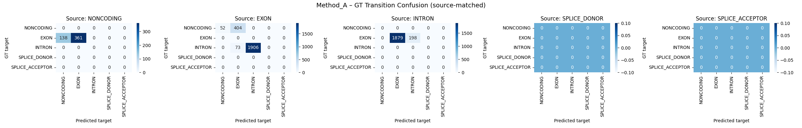
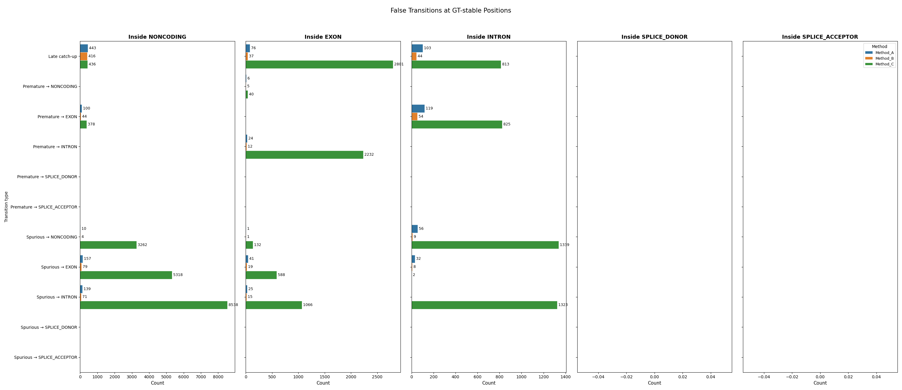

# Transition Analysis

Transition analysis answers a different question from the metric families: what
happens exactly at label changes, and where does the model introduce spurious
changes when GT stays stable?

Requested via `EvalMetrics.STATE_TRANSITIONS` (kept in the default metric set, so
it runs unless an explicit `metrics` list omits it). When enabled, the outputs
appear in aggregated benchmark results as:

- `transition_failures`
- `false_transitions`

Transition analysis honours `evaluation_scope`: out-of-scope exonic content is
demoted to background before the arrays are compared, so under the `cds` scope
5'/3' UTR read as `NONCODING` and a UTR-aware prediction is not penalised against
a CDS-only ground truth. `INTRON` and splice labels are always kept, and the
default `transcript_exon` scope demotes nothing.

## GT Transition Confusion Matrices

At every position where the GT label changes, the benchmark records:

- the GT source label
- the GT target label
- the predicted target label at the same transition, but only for exact on-site
  transitions where the prediction is still in the GT source state immediately
  before the boundary

The result is one confusion matrix per GT source label.

How to read it:

- rows: GT target label
- columns: predicted target label
- one panel: one GT source label

Interpretation:

- mass on the diagonal: the model usually transitions into the correct target
  label
- mass off the diagonal: the model sees a transition but assigns the wrong
  target class
- boundaries that were reached too early, too late, or from the wrong source
  state are intentionally left out here and are instead represented in the
  false-transition analysis below

This is useful when a model roughly detects exon boundaries but confuses exon,
intron, donor, or acceptor labels around those boundaries.

## False Transitions

False transitions are counted at positions where GT stays on the same label but
the prediction changes label.

The plot separates three behaviors:

- `Late catch-up`: the model stayed in the GT label too long before changing
- `Premature -> X`: the model left the GT label too early and transitioned into
  label `X`
- `Spurious -> X`: the model introduced a transition into label `X` where GT
  should have remained stable

There can be spurious transitions to the same label, e.g. NONCODING -> NONCODING since another spurious
transition before transitioned out of NONCODING. Late catch-up and premature transitions exclusively happen at the
edges of a coding region if the predicted up or downstream label is continous and does not change up to the GT transition.

Interpretation:

- many false transitions inside `EXON`: fragmentation of coding segments
- many false transitions inside `INTRON`: unstable intron labeling or noisy
  splice handling
- strong `Late catch-up`: boundaries are found, but shifted downstream

## When To Look At These Plots

These plots are especially useful when:

- Region Discovery looks acceptable, but transcript structure is still weak
- one model seems over-fragmented
- splice-site labels are present and you want to see exactly which transitions
  are confused

## Caveats

- Transition analysis is local. It complements transcript-level metrics rather
  than replacing them.
- Large transition counts do not always imply large biological errors; a model
  can make many local label mistakes within one otherwise recognizable
  transcript.
- The false-transition plot shows **raw counts**, not rates. The benchmark also
  emits `stable_position_counts` (positions per label where GT was stable),
  which is the natural denominator for rates, but the plotting layer does not
  divide by it. This means a method evaluated on a longer corpus, or on a
  label that simply occurs more often, will look worse even if its
  per-position error rate is identical. Compare counts only across runs that
  share the same input set, or normalise by `stable_position_counts` yourself
  when comparing methods on different inputs.
- The per-source-label confusion matrices count only on-site transitions
  where the prediction was already in the GT source state. Off-track
  predictions (model already left the GT source state when GT changes) are
  pushed into the `spurious` bucket, not the GT confusion matrix.
- At array edges (no earlier or later GT transition exists), the lookbehind
  / lookahead values default to the current GT label as a sentinel that can
  never match — so edge positions are never classified as `late_catchup` or
  `premature`.
- `plot_false_transitions` returns `None` (no figure) when no method has any
  false transitions, so the figure key is silently absent rather than
  appearing as an empty plot.
